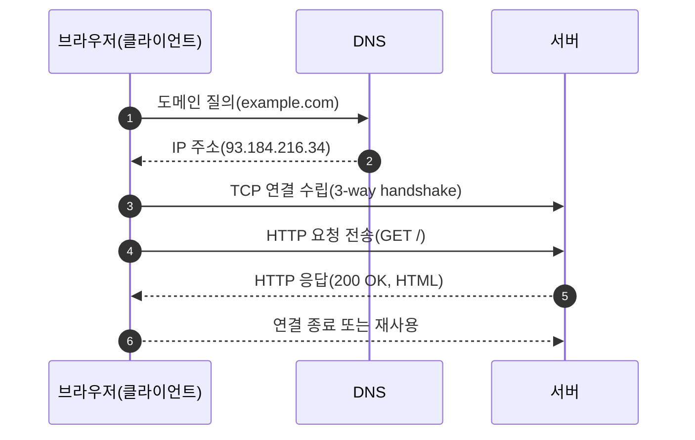
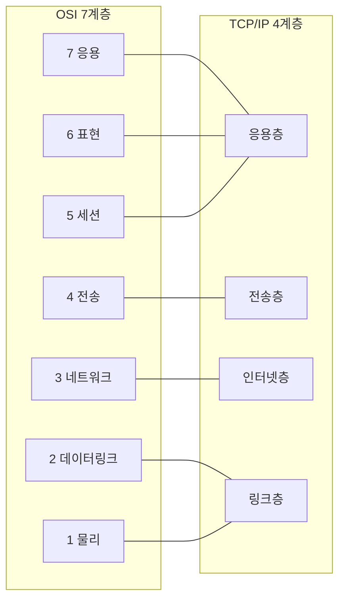

# Chapter 01 인터넷 네트워크

## 01-1 인터넷 통신

### 개요
이 섹션에서는 인터넷이 어떻게 동작하는지, 데이터가 어떻게 잘게 나뉘어 전달되는지(패킷 교환), 그리고 클라이언트-서버 간 요청/응답의 큰 흐름을 이해합니다. 또한 OSI 7계층과 TCP/IP 4계층을 간략히 비교해 네트워크 계층화 개념을 잡습니다.

학습 목표
- 인터넷 통신의 기본 흐름(요청/응답)을 설명할 수 있다.
- 패킷 교환의 개념과 장점을 이해한다.
- OSI 7계층과 TCP/IP 모델을 큰 틀에서 비교할 수 있다.

### 인터넷은 어떻게 통신할까?
인터넷 통신은 기본적으로 클라이언트가 서버에 요청(request)을 보내고, 서버가 이에 대한 응답(response)을 반환하는 구조입니다. 웹에서는 HTTP가 이 요청/응답의 규칙(프로토콜)을 정의합니다. 하지만 HTTP 메시지가 실제로 네트워크를 통해 이동하려면, 아래 계층(IP, TCP/UDP 등)의 도움을 받아 실제 전송이 이뤄집니다.

#### 요청/응답의 큰 그림
- 클라이언트(브라우저)는 URL로 리소스(문서/이미지/데이터)를 요청한다.
- 전송 전, 이름(Domain)을 숫자 주소(IP)로 바꾸는 과정(DNS 질의)이 선행될 수 있다.
- 연결 수립(TCP 핸드셰이크 등) 후, HTTP 요청 메시지가 전송된다.
- 서버는 요청을 처리하고 HTTP 응답 메시지를 반환한다.
- 필요 시 연결을 종료하거나 재사용(keep-alive)한다.

### 패킷 교환(Packet Switching)
현대 인터넷은 대체로 패킷 교환 방식을 사용합니다. 큰 데이터는 고정 혹은 가변 크기의 작은 조각(패킷)으로 나뉘고, 각각 독립적으로 네트워크를 통해 전달됩니다.

#### 왜 패킷으로 나눌까?
- 경로 유연성: 각 패킷이 다른 경로로 이동해도 목적지에서 재조립 가능.
- 효율적 자원 활용: 회선을 독점하지 않고 여러 통신이 링크를 공유.
- 신뢰성 향상: 손실된 패킷만 재전송하면 됨(특히 TCP).

#### 패킷의 이동과 재조립
- 송신 측: 애플리케이션 데이터 → TCP/UDP 세그먼트 → IP 패킷 → 링크 프레임 순으로 캡슐화되어 전송.
- 중간 라우터: 라우팅 테이블로 다음 홉 결정, 패킷을 포워딩.
- 수신 측: 역캡슐화로 상위 계층 데이터 복원, 애플리케이션에 전달.

### 계층 모델 한눈에 보기: OSI vs TCP/IP
네트워크는 복잡한 기능을 계층으로 나눠 서로 독립적으로 설계/구현되도록 합니다.

요점
- 응용/표현/세션(OSI 7,6,5)은 TCP/IP에선 응용층으로 뭉쳐진다.
- 전송층: TCP(신뢰성, 흐름/혼잡 제어)와 UDP(경량, 비연결성)가 대표.
- 인터넷층: IP가 주소 지정과 라우팅을 담당.
- 링크/물리: 같은 네트워크 구간에서의 프레임 전송과 전기/무선 신호.

### 좀 더 알아보기: 지연과 대역폭, 그리고 신뢰성
- 지연(latency): 왕복 시간(RTT), 큐잉/전파/처리 지연의 합으로 체감 속도에 영향.
- 대역폭(bandwidth): 단위 시간당 전송 가능한 최대량. 대용량 전송 효율에 영향.
- 신뢰성(reliability): 손실/중복/순서 뒤바뀜을 어떻게 처리하는가(TCP 재전송, 순서 보장 등).

### 5가지 키워드로 정리하는 핵심 포인트
1. **요청/응답**: 웹은 클라이언트-서버의 요청/응답 사이클로 동작.
2. **패킷 교환**: 데이터를 작은 패킷으로 쪼개 효율과 탄력성을 확보.
3. **계층화**: OSI와 TCP/IP 모델로 복잡성을 분리.
4. **라우팅**: 중간 장비가 최적 경로로 패킷을 전달.
5. **신뢰성**: TCP는 신뢰성/흐름/혼잡 제어로 안정적 전송을 지원.

### 확인 문제
1. 인터넷에서 대용량 데이터를 작은 단위로 나누어 전달하는 방식은 무엇인가?
    - [ ] 회선 교환(Circuit Switching)
    - [ ] 브로드캐스트 스위칭(Broadcast Switching)
    - [ ] 패킷 교환(Packet Switching)
    - [ ] 멀티캐스트 스위칭(Multicast Switching)

2. 다음 중 TCP/IP 모델에서 IP가 속한 계층은?
    - [ ] 응용층(Application)
    - [ ] 전송층(Transport)
    - [ ] 인터넷층(Internet)
    - [ ] 링크층(Link)

3. 다음 중 옳은 것을 모두 고르시오. (복수 응답)
    - [ ] 인터넷은 주로 패킷 교환 방식을 사용한다.
    - [ ] OSI의 응용/표현/세션 계층은 TCP/IP의 응용층으로 대응된다.
    - [ ] UDP는 연결 지향이며 순서 보장을 기본 제공한다.
    - [ ] TCP는 손실 패킷 재전송과 혼잡 제어를 통해 신뢰성을 높인다.
    - [ ] 라우터는 전송층의 세그먼트를 기준으로 포워딩한다.

> [정답 및 해설 보기](../answers_and_explanations.md#ans-01-1-인터넷-통신)
