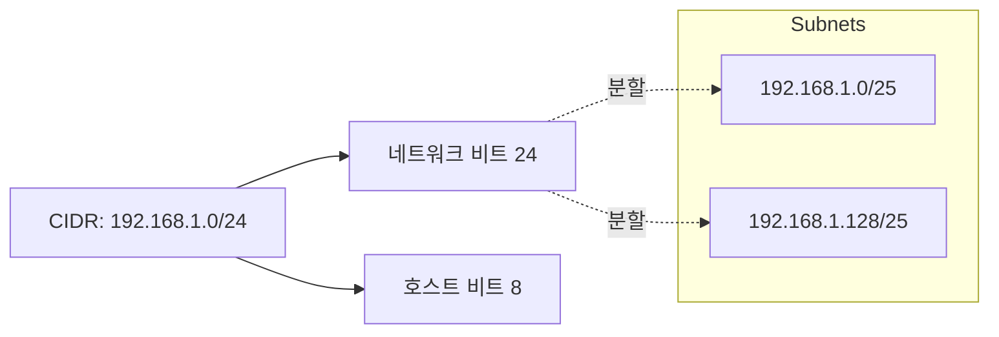
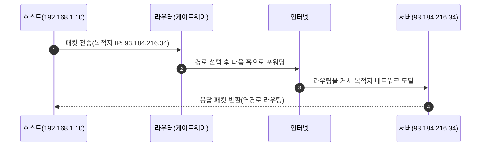
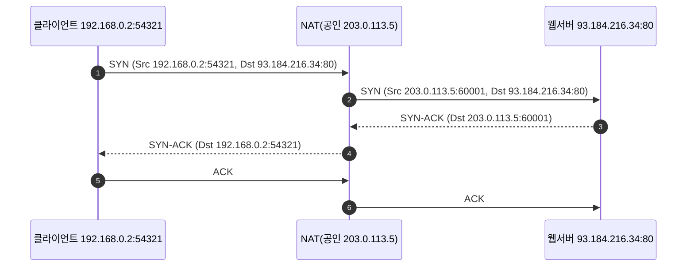
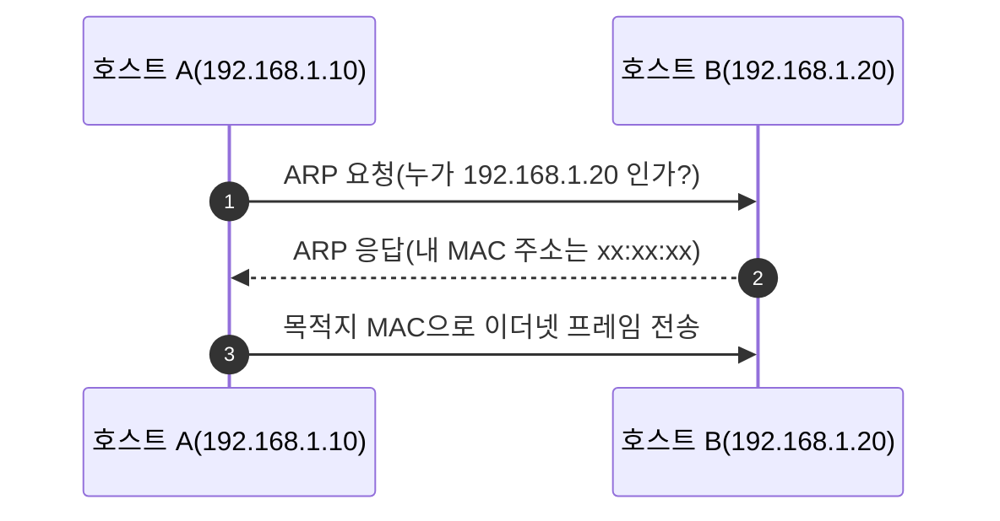

# Chapter 01 인터넷 네트워크

## 01-2 IP(인터넷 프로토콜)

### 개요
이 섹션에서는 인터넷 프로토콜(IP)의 핵심 역할과 동작 방식을 다룹니다. IP 주소 체계(IPv4/IPv6), 서브넷과 CIDR 표기, 라우팅과 게이트웨이, IP 패킷 헤더의 주요 필드, MTU와 단편화, NAT와 사설/공인 IP, 그리고 ARP를 통해 같은 네트워크 내에서 MAC 주소를 알아내는 과정을 학습합니다.

학습 목표
- IPv4/IPv6 주소 표기와 사설/공인 IP의 차이를 설명할 수 있다.
- 서브넷 마스크와 CIDR을 사용해 네트워크/호스트 범위를 해석할 수 있다.
- 기본 게이트웨이를 통해 라우팅되는 흐름을 이해하고 설명할 수 있다.
- IP 패킷 헤더의 핵심 필드(소스/목적지, TTL, 프로토콜 등)와 단편화 이슈를 이해한다.
- NAT(주소 변환)의 필요성과 동작 흐름을 설명할 수 있다.

### IP 주소 체계: IPv4와 IPv6
IP는 각 호스트를 식별하기 위한 주소를 제공합니다.

#### IPv4
- 표기: 32비트, 10진수 점 표기 예) 192.168.0.10
- 사설 대역: 10.0.0.0/8, 172.16.0.0/12, 192.168.0.0/16
- 공인 IP: 인터넷에서 직접 라우팅 가능한 주소
- 고갈 문제: 주소 공간 제한으로 NAT, CIDR, IPv6 도입

#### IPv6
- 표기: 128비트, 16진수 콜론 표기 예) 2001:db8::1
- 장점: 방대한 주소 공간, 단순화된 헤더, 확장성
- 전개: 이중 스택(dual stack) 운영이 일반적(IPv4와 병행)

### 서브네팅과 CIDR
같은 네트워크에 속하는 주소 범위를 나누어 관리합니다.

#### 서브넷 마스크와 CIDR
- 서브넷 마스크 예: 255.255.255.0 은 /24 와 동일(CIDR)
- CIDR 표기: 192.168.1.0/24 → 네트워크 비트 24개, 호스트 비트 8개
- 네트워크 주소/브로드캐스트 주소 구분 필요

#### 간단 예시
- 192.168.1.0/24 → 호스트 범위: 192.168.1.1 ~ 192.168.1.254
- 192.168.1.0/25 → 호스트 범위: 192.168.1.1 ~ 192.168.1.126

### 라우팅과 기본 게이트웨이
서로 다른 네트워크 간 통신은 라우터를 통해 이루어집니다.

#### 같은 네트워크 vs 다른 네트워크
- 같은 네트워크: ARP로 목적지 MAC을 알아내어 직접 전송
- 다른 네트워크: 기본 게이트웨이(라우터)의 MAC으로 전송 → 라우터가 다음 홉으로 포워딩

### IP 패킷 헤더 핵심 필드
- 소스/목적지 IP: 송신자/수신자 식별
- TTL(Time To Live): 홉을 지날 때마다 감소, 0이 되면 폐기(루프 방지)
- 프로토콜: 상위 전송 계층 식별(TCP=6, UDP=17 등)
- 식별자/오프셋/플래그(IPv4): 단편화 관련 필드
- 체크섬(IPv4 헤더): 헤더 무결성 검사

### MTU와 단편화(Fragmentation)
네트워크 링크마다 MTU(최대 전송 단위)가 다를 수 있습니다.
- IP는 MTU를 초과하는 패킷을 단편화하여 여러 조각으로 전송(IPv4)
- DF(단편화 금지) 설정 시 MTU 초과면 폐기 + ICMP 메시지 반환
- 실무에선 PMTUD(경로 MTU 발견)로 최적 크기 탐색

### NAT와 사설/공인 IP
공유기 등 NAT 장비는 사설 IP를 공인 IP로 변환해 다수의 단말이 인터넷을 공유하도록 합니다.
- 목적: IPv4 고갈 완화, 내부 주소 은닉, 간단한 보안 이점
- 방식: 소스 NAT(특히 PAT/포트 주소 변환)로 다수의 내부 연결을 하나의 공인 IP로 매핑

### 같은 네트워크에서의 ARP
- 역할: IP→MAC 주소 해석
- 과정: ARP 요청(브로드캐스트) → ARP 응답(목적지 MAC 포함) → 이후 프레임 전송

### 6가지 키워드로 정리하는 핵심 포인트
1. **주소 지정**: IP는 호스트를 식별하고, IPv4/IPv6 두 체계를 사용한다.
2. **서브네팅**: CIDR로 네트워크/호스트 범위를 효율적으로 관리한다.
3. **라우팅**: 다른 네트워크로는 기본 게이트웨이를 통해 패킷을 보낸다.
4. **헤더 필드**: TTL, 프로토콜, 단편화 필드가 전송 동작을 좌우한다.
5. **MTU/단편화**: 링크 MTU에 맞추어 조각화되거나 PMTUD로 크기를 조정한다.
6. **NAT/ARP**: NAT로 사설→공인 변환, ARP로 같은 망에서 MAC을 해석한다.

### 확인 문제
1. 다음 중 사설 IPv4 대역이 아닌 것은?
    - [ ] 10.0.0.0/8
    - [ ] 172.16.0.0/12
    - [ ] 192.168.0.0/16
    - [ ] 203.0.113.0/24

2. IPv4 헤더의 TTL 필드가 0이 되었을 때 올바른 설명은?
    - [ ] 패킷은 목적지에 반드시 도착한다
    - [ ] 패킷은 라우터에서 폐기되고 경고 없이 사라진다
    - [ ] 패킷은 라우터에서 폐기될 수 있으며, ICMP 메시지가 생성될 수 있다
    - [ ] TTL은 TCP 전송에만 사용된다

3. 다음 중 NAT 동작과 관련하여 옳은 것을 모두 고르시오. (복수 응답)
    - [ ] 사설 IP를 공인 IP로 변환해 여러 단말이 인터넷을 공유할 수 있다
    - [ ] NAT는 IPv6에서 필수이며 항상 사용된다
    - [ ] 포트 주소 변환(PAT)을 통해 다수의 연결을 하나의 공인 IP에 매핑할 수 있다
    - [ ] NAT 환경에서도 포트 포워딩을 통해 내부 서버에 대한 외부 접속을 허용할 수 있다
    - [ ] NAT는 ARP의 대체 기술이다

> [정답 및 해설 보기](../answers_and_explanations.md#ans-01-2-ip-인터넷-프로토콜)
