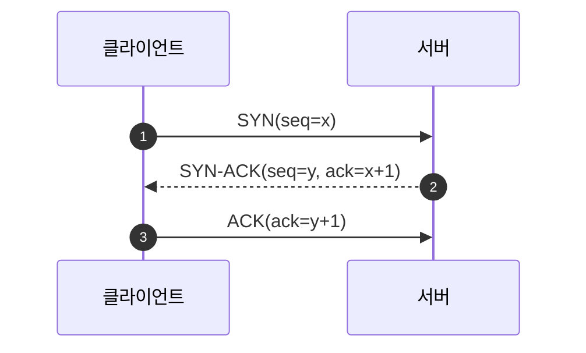
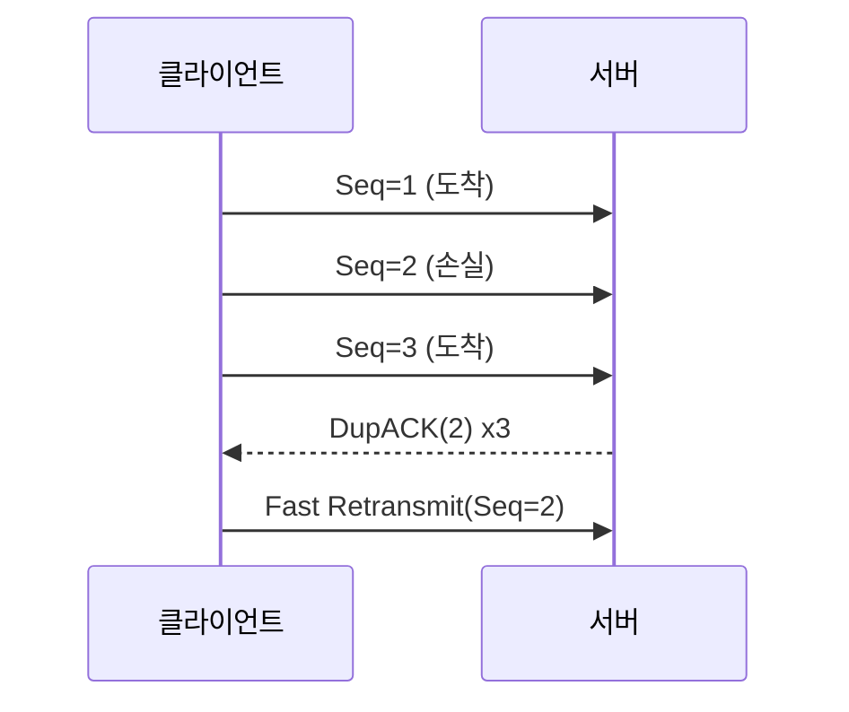
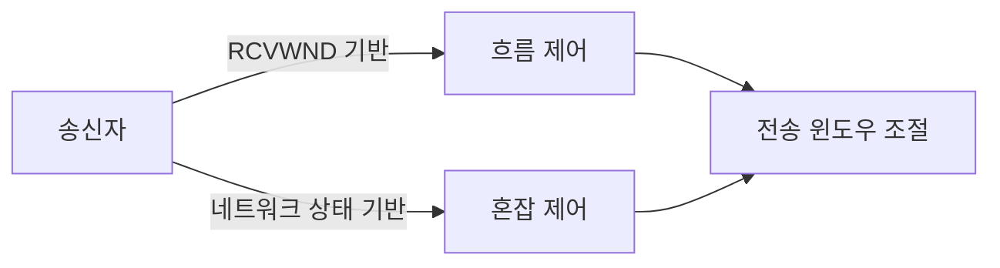
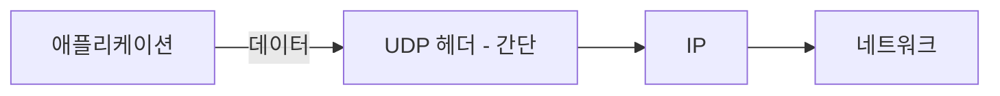
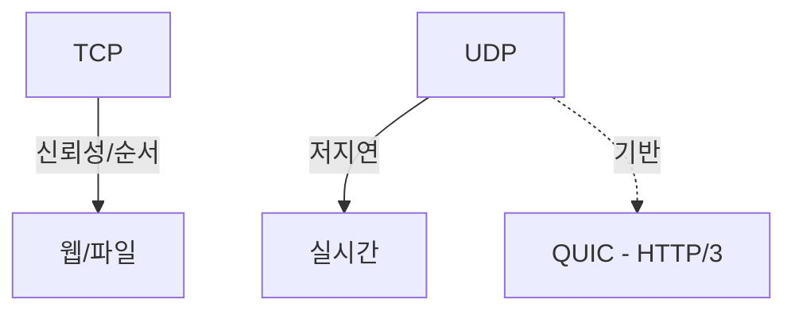

# Chapter 01 인터넷 네트워크

## 01-3 TCP, UDP

### 개요
이 섹션에서는 전송 계층의 두 핵심 프로토콜인 TCP와 UDP의 특성과 차이를 학습합니다. TCP의 연결지향성, 신뢰성(재전송/순서 보장), 흐름/혼잡 제어를 이해하고, UDP의 비연결성, 경량성, 브로드캐스트/멀티캐스트 및 실시간성 장점을 비교합니다. 또한 웹/파일 전송(TCP)과 스트리밍/게임(UDP)과 같은 대표적인 활용 사례를 통해 어떤 상황에서 어떤 프로토콜을 선택해야 하는지 판단할 수 있습니다.

학습 목표
- TCP의 3-way 핸드셰이크와 신뢰성 제공 메커니즘을 설명할 수 있다.
- 흐름 제어와 혼잡 제어의 목적과 차이를 구분할 수 있다.
- UDP의 비연결 특성과 오버헤드가 낮은 장점을 설명할 수 있다.
- 용도별로 TCP/UDP를 적절히 선택하는 이유를 제시할 수 있다.

### TCP: 연결지향과 신뢰성
TCP(Transmission Control Protocol)는 신뢰성 있는 바이트 스트림을 제공합니다.

#### 연결 수립: 3-way 핸드셰이크

- 목적: 초기 순서 번호(ISN)를 교환하고 양방향 송수신 준비를 확인
- 결과: 연결 상태 established, 이후 데이터 전송 가능

#### 신뢰성: 순서 보장, 재전송, 확인 응답
- 세그먼트에 순서 번호(seq)와 확인 응답(ACK)을 사용하여 순서를 보장
- 손실 감지 시 재전송(Retransmission) 수행
- 수신 측은 중복 ACK 또는 누락 감지로 재정렬 및 손실 알림

#### 흐름 제어와 혼잡 제어
- 흐름 제어(Flow Control): 수신자의 처리 능력에 맞춰 윈도우(Receive Window) 크기로 송신 속도 조절
- 혼잡 제어(Congestion Control): 네트워크 혼잡을 완화하기 위해 혼잡 윈도우(cwnd), 슬로우 스타트, 혼잡 회피, 빠른 재전송/복구 등 알고리즘 적용

#### TCP 세그먼트의 주요 필드(개념)
- 소스/목적지 포트
- 시퀀스 번호/확인 응답 번호
- 플래그: SYN, ACK, FIN, RST, PSH, URG
- 윈도우 크기, 체크섬, 옵션(MSS, SACK 등)

### UDP: 비연결, 경량, 실시간 친화
UDP(User Datagram Protocol)는 연결 설정 없이 데이터그램을 전송합니다.

#### 특성
- 비연결(Connectionless), 핸드셰이크 없음 → 지연이 낮고 오버헤드가 적음
- 신뢰성/순서 보장/혼잡 제어를 제공하지 않음(필요 시 애플리케이션 계층에서 보완)
- 브로드캐스트/멀티캐스트를 지원하여 실시간 분배에 유리

#### 대표적 활용
- 스트리밍 미디어, 온라인 게임, 실시간 음성/영상(VoIP, WebRTC)
- DNS 쿼리(작고 빠른 왕복 필요)
- IoT/텔레메트리 등 경량 통신

### TCP vs UDP: 언제 어떤 것을 쓸까?
- TCP를 선택:
  - 신뢰성과 순서 보장이 중요: 웹(HTTP/1.1, HTTP/2), 파일 전송(FTP, SFTP), 이메일(SMTP-전송 단계), 데이터베이스 연결 등
  - 손실 시 반드시 재전송되어야 하는 업무 트랜잭션
- UDP를 선택:
  - 지연이 중요하고 약간의 손실을 허용: 라이브 스트리밍, 실시간 게임, 음성/영상 통화
  - 브로드캐스트/멀티캐스트 기반 분배
- 현대 동향: HTTP/3는 QUIC(UDP 기반)를 사용하여 연결 설정/복구와 혼잡 제어를 애플리케이션 계층에서 구현, 핸드셰이크 감소와 헤드-오브-라인 블로킹 문제 완화

### 6가지 키워드로 정리하는 핵심 포인트
1. **연결지향(TCP)**: 3-way 핸드셰이크로 신뢰 가능한 통신 채널을 수립한다.
2. **신뢰성(TCP)**: 순서 보장, ACK, 재전송, SACK으로 데이터 무결성을 높인다.
3. **제어(TCP)**: 흐름 제어와 혼잡 제어로 수신자/네트워크 상태를 고려해 전송량을 조절한다.
4. **비연결(UDP)**: 핸드셰이크 없이 빠르고 가볍게 전송한다.
5. **실시간성(UDP)**: 손실 허용 시 낮은 지연과 멀티캐스트로 대규모 분배에 유리하다.
6. **용도 구분**: 웹/파일은 TCP, 스트리밍/게임/VoIP는 UDP 또는 QUIC를 고려한다.

### 확인 문제
1. TCP 3-way 핸드셰이크의 올바른 순서는?
    - [ ] ACK → SYN → SYN-ACK
    - [ ] SYN → ACK → SYN-ACK
    - [ ] SYN → SYN-ACK → ACK
    - [ ] SYN-ACK → SYN → ACK

2. 다음 중 TCP가 제공하는 기능은?
    - [ ] 브로드캐스트 전송
    - [ ] 순서 보장과 재전송 메커니즘
    - [ ] 멀티캐스트 네이티브 지원
    - [ ] 핸드셰이크 없이 전송

3. 다음 중 UDP의 특징과 활용에 대해 옳은 것을 모두 고르시오. (복수 응답)
    - [ ] 연결 설정 없이 전송하며 오버헤드가 낮다
    - [ ] 패킷 순서 보장과 혼잡 제어를 기본 제공한다
    - [ ] 실시간 스트리밍이나 온라인 게임에 자주 사용된다
    - [ ] DNS 질의에 흔히 사용된다
    - [ ] HTTP/3는 UDP와 무관하다

> [정답 및 해설 보기](../answers_and_explanations.md#ans-01-3-tcp-udp)
