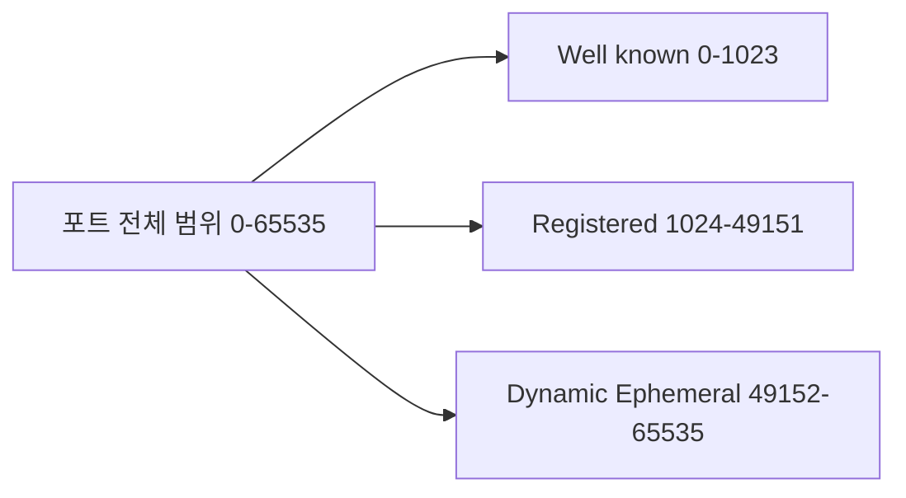
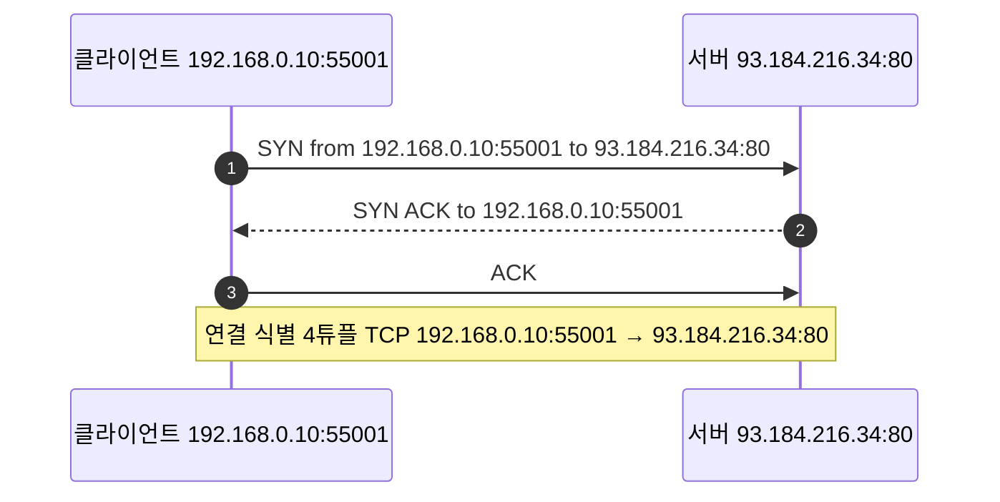
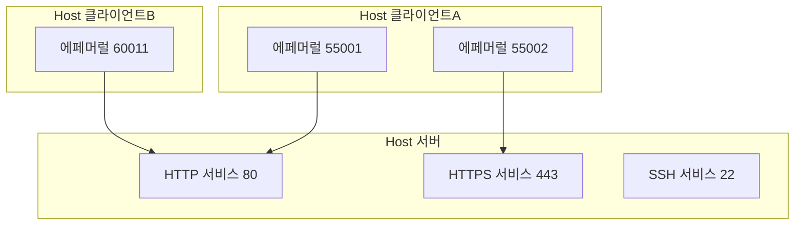
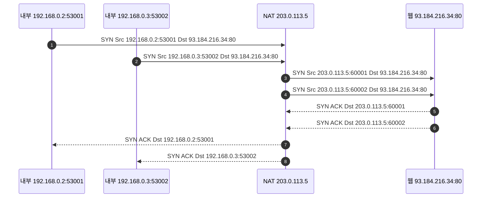
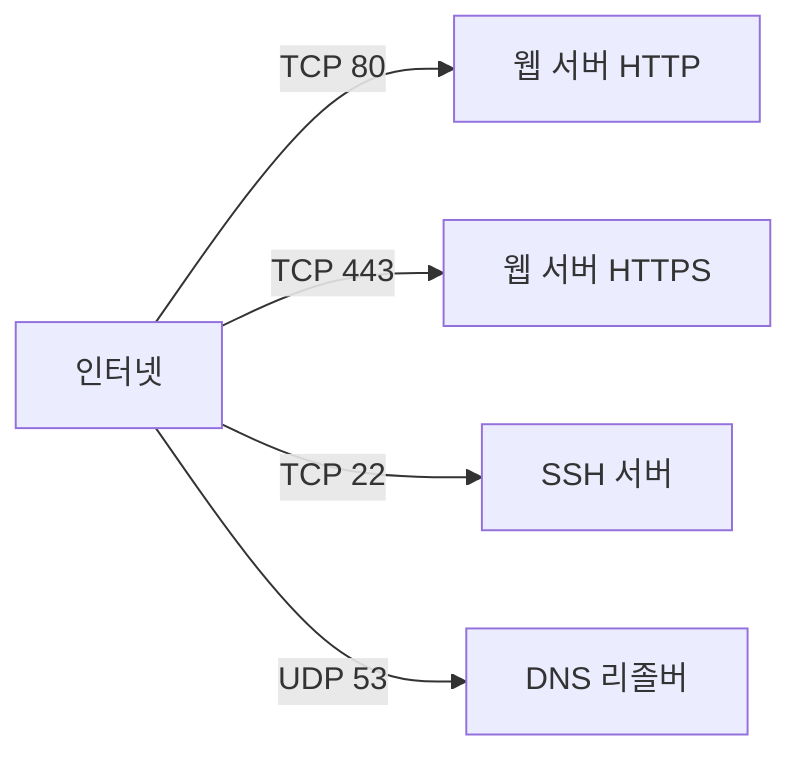

# Chapter 01 인터넷 네트워크

## 01-4 PORT

### 개요
이 섹션에서는 포트(Port)의 역할과 범위를 학습합니다. 포트는 "하나의 IP 내에서 여러 애플리케이션 프로세스를 구분"하는 숫자 식별자입니다. Well-known, Registered, Dynamic 포트의 범위와 의미, 소켓(아이피와 포트)으로 프로세스에 매핑되는 원리, 서버의 리스닝 포트와 클라이언트의 에페머럴 포트 차이, NAT 환경에서의 포트 주소 변환(PAT), 그리고 대표 서비스 포트 예시(HTTP 80, HTTPS 443 등)를 다룹니다.

학습 목표
- 포트의 정의와 범위를 설명할 수 있다.
- 소켓(IP와 포트)의 조합이 통신 흐름에서 어떤 의미를 갖는지 설명할 수 있다.
- 서버 리스닝 포트와 클라이언트 에페머럴 포트의 차이를 구분할 수 있다.
- NAT의 포트 변환(PAT) 개념과 외부에서 내부 서비스로의 연결 원리를 설명할 수 있다.
- 주요 서비스 포트 번호 예시를 제시할 수 있다.

### 포트의 개념과 범위
포트는 전송 계층(TCP, UDP)에서 애플리케이션 프로세스를 식별하는 16비트 숫자입니다(0~65535).

#### 포트 범위 분류
- Well-known: 0~1023 (시스템/표준 서비스)
- Registered: 1024~49151 (등록 애플리케이션)
- Dynamic or Ephemeral: 49152~65535 (일시적 클라이언트 포트)

참고: 실제 운영체제의 에페머럴 포트 범위는 다를 수 있습니다(예: Linux 기본 32768~60999 등). 하지만 IANA 권장 범위는 49152~65535입니다.

### 소켓과 프로세스 매핑
소켓은 "IP 주소 + 포트 번호"의 조합으로, TCP/UDP 통신의 종단점을 식별합니다. 네트워크 연결은 일반적으로 "소스 IP:소스 포트 → 목적지 IP:목적지 포트"의 4튜플(전송 계층 프로토콜까지 포함하면 5튜플)로 고유합니다.

- 서버는 특정 포트에서 리스닝합니다(예: TCP 80). 동일 서버에서 여러 서비스는 서로 다른 포트를 사용합니다.
- 클라이언트는 요청마다 에페머럴 포트를 할당받아 연결을 구분합니다.
- 동일한 서버 포트로 다수의 동시 연결을 처리할 수 있는 이유는 각 연결의 소스 IP/포트가 달라 4튜플이 고유하기 때문입니다.

### 서버 포트와 클라이언트 에페머럴 포트
- 리스닝 포트: 서버가 수신 대기하는 고정 포트(예: 80, 443, 22). 서비스 식별에 사용됩니다.
- 에페머럴 포트: 클라이언트가 일시적으로 사용하는 포트로, OS가 자동 할당합니다.

### NAT와 포트 주소 변환(PAT)
NAT 장비는 사설 네트워크의 다수 호스트가 하나의 공인 IP를 공유하도록 주소와 포트를 변환합니다. PAT(Port Address Translation)는 소스 포트를 바꿔 다수의 연결을 하나의 공인 IP에 매핑합니다.

- 외부에서 내부 서버로 접속하려면 포트 포워딩 규칙을 설정해 공인 IP의 특정 포트를 내부 IP:포트로 매핑해야 합니다.

### 주요 서비스 포트 예시
- HTTP: TCP 80
- HTTPS: TCP 443
- SSH: TCP 22
- DNS: UDP 53 (일부 상황에서 TCP 53)
- SMTP: TCP 25
- NTP: UDP 123

### 6가지 키워드로 정리하는 핵심 포인트
1. **식별자**: 포트는 동일 IP에서 여러 애플리케이션을 구분하는 16비트 번호이다.
2. **범위**: Well-known 0~1023, Registered 1024~49151, Dynamic 49152~65535.
3. **소켓**: IP와 포트의 조합으로 연결 종단을 식별하며 4튜플로 동시 연결을 구분한다.
4. **역할 분담**: 서버는 리스닝 포트, 클라이언트는 에페머럴 포트로 통신한다.
5. **NAT/PAT**: 포트 변환으로 다수 내부 연결을 하나의 공인 IP로 매핑하고, 포트 포워딩으로 외부 접근을 허용한다.
6. **서비스 예시**: HTTP 80, HTTPS 443, SSH 22, DNS 53 등 잘 알려진 포트를 이해한다.

### 확인 문제
1. 포트 범위 분류에 대한 설명으로 옳은 것은?
    - [ ] Well-known은 1024~49151 이다
    - [ ] Registered는 0~1023 이다
    - [ ] Dynamic Ephemeral은 49152~65535 이다
    - [ ] 모든 운영체제의 에페머럴 범위는 반드시 49152~65535 이다

2. 다음 중 소켓과 연결 식별에 대한 올바른 설명은?
    - [ ] 서버는 하나의 포트로는 동시에 하나의 연결만 처리할 수 있다
    - [ ] 클라이언트는 에페머럴 포트를 사용해 각 연결을 구분한다
    - [ ] 같은 서버 포트로 동시에 여러 연결이 가능한 이유는 소스 IP와 포트가 달라 4튜플이 고유하기 때문이다
    - [ ] 연결의 고유 식별은 IP 주소만으로 충분하다

3. NAT와 포트 포워딩에 대해 옳은 것을 모두 고르시오. (복수 응답)
    - [ ] PAT는 소스 포트를 변경해 여러 내부 연결을 하나의 공인 IP에 매핑한다
    - [ ] 외부에서 내부 웹 서버로 접근하려면 포트 포워딩 등 매핑 규칙이 필요하다
    - [ ] NAT 환경에서는 포트 개념이 사라지므로 포트 번호는 사용되지 않는다
    - [ ] DNS는 항상 TCP 53만 사용하므로 포트 포워딩이 필요 없다
    - [ ] 같은 공인 IP의 서로 다른 포트에 서로 다른 내부 서비스(포트)를 매핑할 수 있다

> [정답 및 해설 보기](../answers_and_explanations.md#ans-01-4-port)
