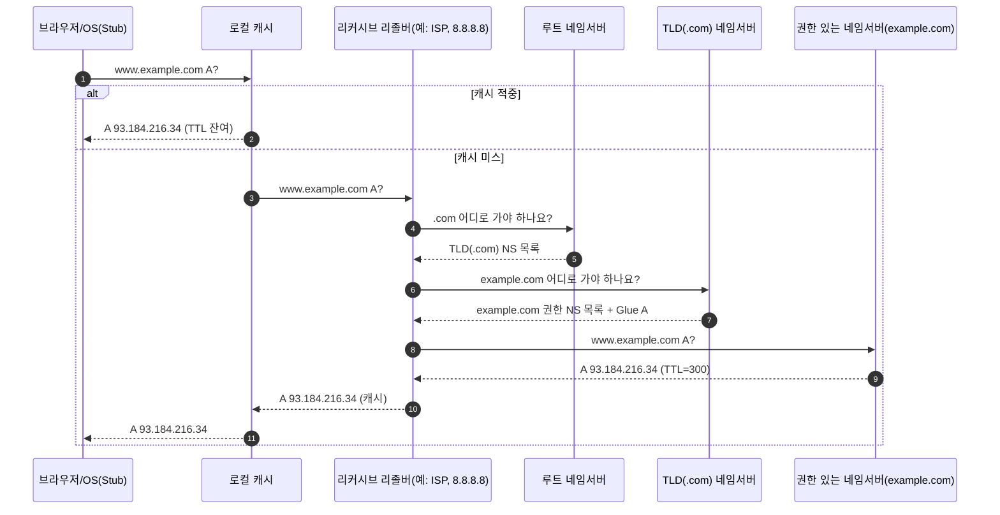
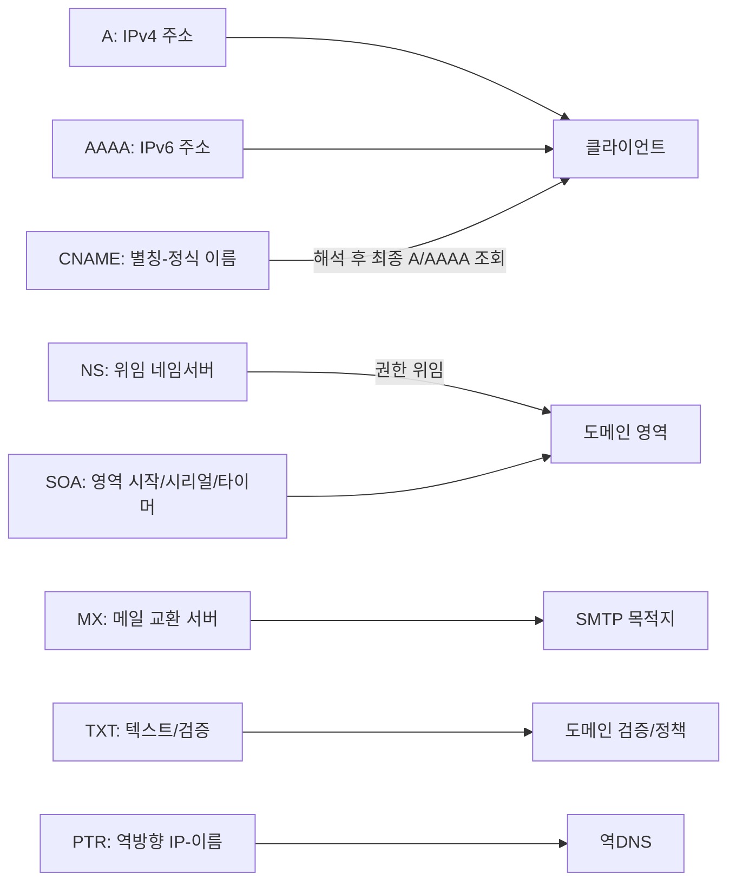
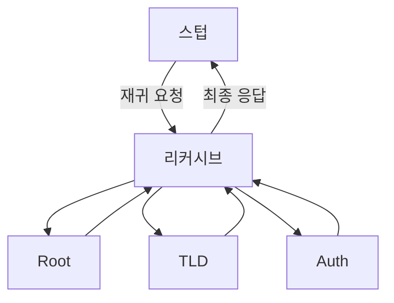
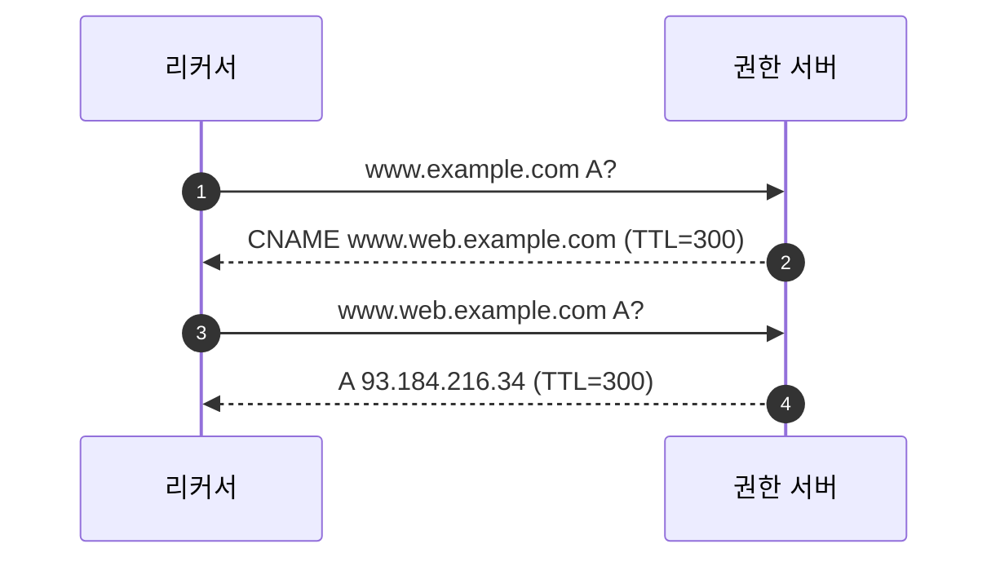

# Chapter 01 인터넷 네트워크

## 01-5 DNS

### 개요
이 섹션에서는 DNS(Domain Name System)가 도메인 네임을 IP 주소로 변환하는 원리와 실제 조회 흐름을 학습합니다. 로컬 캐시에서 시작해 리커시브 리졸버, 루트/최상위 도메인(TLD)/권한 있는 네임서버를 거치는 과정, A/AAAA/CNAME/NS/MX/TXT/ SOA/PTR 등 주요 레코드 타입, 재귀/반복 질의 차이, TTL 기반 캐싱과 유효기간, 그리고 언제 UDP와 TCP가 사용되는지까지 실무 관점에서 이해합니다.

학습 목표
- 브라우저가 도메인 입력 시 어떤 순서로 DNS 조회가 일어나는지 설명할 수 있다.
- A/AAAA/CNAME/NS/MX/TXT/SOA/PTR 등 주요 레코드 타입의 목적을 구분할 수 있다.
- 재귀(Recursive) vs 반복(Iterative) 질의의 차이와 캐싱(TTL)의 효과를 설명할 수 있다.
- 일반적으로 UDP 53을 사용하지만 언제 TCP 53이 필요한지 이해한다(응답 크기, 영역 전송 등).
- CNAME 체인과 권한 위임(Delegation) 구조를 다이어그램으로 설명할 수 있다.

### DNS는 왜 필요한가
- 사람 친화적 이름(예: www.example.com)을 기계가 사용 가능한 IP 주소(예: 93.184.216.34)로 변환
- 서비스 가용성과 운영 편의: IP 변경 시 이름만 유지하면 클라이언트 설정 변경 최소화

### DNS 조회 흐름(고수준)

### 주요 레코드 타입 한눈에 보기

- A: 호스트의 IPv4 주소를 반환
- AAAA: 호스트의 IPv6 주소를 반환
- CNAME: 별칭 이름을 정식 호스트명으로 매핑(최종적으로 A/AAAA로 해석)
- NS: 특정 하위 도메인의 권한을 다른 네임서버에 위임
- MX: 이메일 수신 서버 도메인 지정(우선순위 포함)
- TXT: SPF, 도메인 소유 검증 등 다양한 텍스트 데이터
- SOA: 존의 기본 정보(마스터, 시리얼, 타이머 등)
- PTR: 역방향 조회(아이피→도메인)

### 재귀 vs 반복 질의
- 재귀(Recursive): 스텁/클라이언트가 리커시브 리졸버에게 “최종 답을 달라”고 요청. 리졸버가 루트→TLD→권한 서버까지 순회하여 결과를 반환하고 캐시한다.
- 반복(Iterative): 리졸버가 상위 서버로부터 “다음으로 이 서버에 물어봐라”와 같은 참조를 받고, 이를 바탕으로 다음 서버에 반복적으로 질의.

### 캐싱과 TTL
- TTL(Time To Live): 레코드의 유효기간. TTL 동안 리졸버/OS는 캐시 사용으로 지연과 트래픽 감소
- 짧은 TTL: 빠른 변경 반영, 캐시 적중률 낮음
- 긴 TTL: 성능 유리, 변경 전파 느림
- 부정 응답(NXDOMAIN)도 캐시될 수 있음(negative caching)

### UDP 53 vs TCP 53, EDNS, 영역 전송
- 기본: UDP 53 사용(왕복 지연 최소화)
- TCP 53 필요 시점:
  - 응답이 큰 경우(과거 512B 한계, EDNS(0)로 확장되었지만 여전히 단편화/필터 이슈 시 TCP 폴백)
  - 존 전송(AXFR/IXFR)과 같이 신뢰성/크기가 필요한 운영 작업
- EDNS(0): UDP에서 더 큰 페이로드 허용을 협상하기 위한 확장

### CNAME 체인과 최종 해석

- CNAME은 해당 이름의 다른 레코드와 함께 존재할 수 없습니다(동일 이름에 CNAME과 A를 동시에 둘 수 없음)
- 최종적으로 A/AAAA를 얻을 때까지 체인을 해석해야 함

### 내부 DNS와 Split-horizon(간단)
- 사내 네트워크에서 동일한 도메인에 대해 내부/외부가 서로 다른 답을 받도록 구성하는 방식
- 보안과 경로 최적화에 유용하지만 설정 일관성 관리가 중요

### 6가지 키워드로 정리하는 핵심 포인트
1. **이름→주소 변환**: DNS는 도메인 이름을 IP로 해석해 통신을 가능케 한다.
2. **위임 구조**: 루트→TLD→권한 서버로 이어지는 계층과 NS 레코드로 권한이 위임된다.
3. **레코드 타입**: A/AAAA/CNAME/NS/MX/TXT/SOA/PTR의 목적을 구분한다.
4. **재귀/반복**: 리커시브 리졸버가 참조를 따라 최종 응답을 구해 캐시한다.
5. **캐싱/TTL**: TTL 동안 캐시를 사용해 지연과 부하를 줄이며, 변경 전파와 트레이드오프가 있다.
6. **전송 방식**: 일반 UDP 53, 큰 응답/영역 전송 등은 TCP 53 또는 EDNS로 처리한다.

### 확인 문제
1. DNS 조회 흐름에 대한 설명으로 옳은 것은?
    - [ ] 브라우저는 항상 루트 네임서버부터 직접 질의한다
    - [ ] 리커시브 리졸버는 최종 응답을 얻기 위해 루트→TLD→권한 서버를 순회할 수 있다
    - [ ] NS 레코드는 호스트의 IPv4 주소를 담는다
    - [ ] TTL은 캐시에 영향을 주지 않는다

2. 다음 중 레코드 타입과 설명의 연결이 올바른 것은?
    - [ ] CNAME: IP 주소를 직접 제공한다
    - [ ] MX: 메일 수신 서버 도메인을 지정한다
    - [ ] TXT: 역방향 조회에 사용된다
    - [ ] SOA: 별칭에서 정식 이름으로의 리다이렉션을 의미한다

3. 다음 중 옳은 것을 모두 고르시오. (복수 응답)
    - [ ] 일반 DNS 질의는 보통 UDP 53을 사용한다
    - [ ] 큰 응답이거나 영역 전송은 TCP 53이 사용될 수 있다
    - [ ] CNAME 레코드와 A 레코드는 동일 이름에 동시에 존재해도 문제가 없다
    - [ ] TTL이 짧으면 변경 사항이 더 빠르게 전파된다
    - [ ] 리커시브 리졸버는 받은 응답을 캐시할 수 없다

> [정답 및 해설 보기](../answers_and_explanations.md#ans-01-5-dns)
