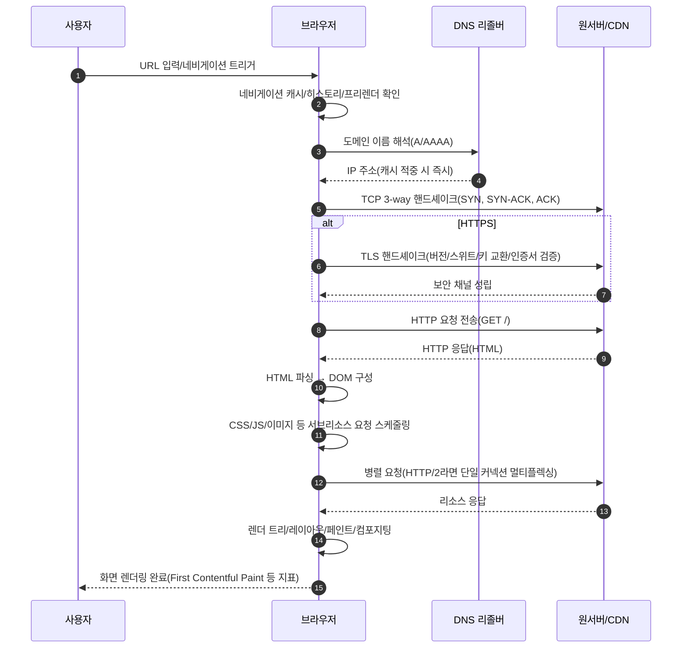
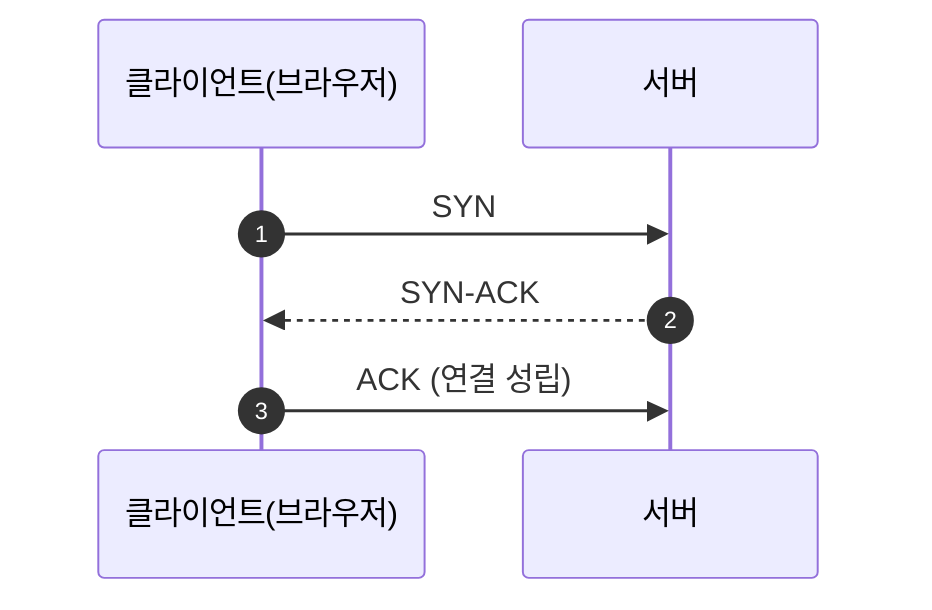
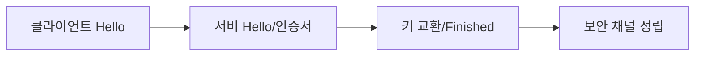
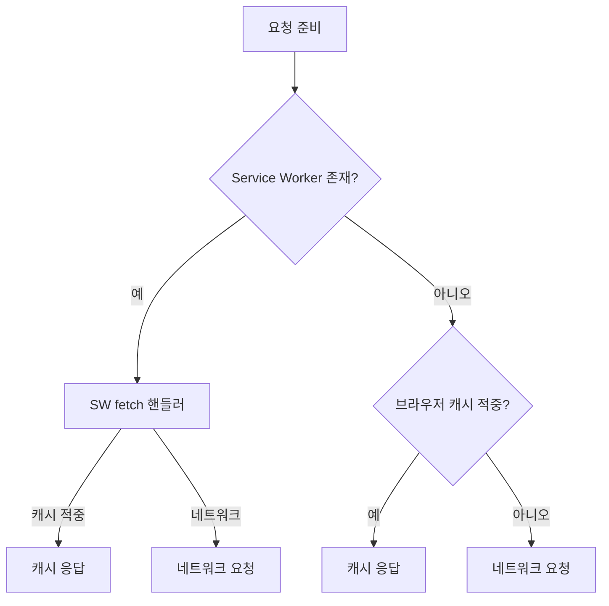

# Chapter 02 URI와 웹 브라우저 요청 흐름

## 02-2 웹 브라우저 요청 흐름

### 개요
이 섹션에서는 사용자가 주소창에 URL을 입력한 순간부터 화면에 페이지가 렌더링될 때까지의 전체 흐름을 한눈에 살펴봅니다. DNS 조회, TCP 3-way 핸드셰이크, TLS(HTTPS) 협상, HTTP 요청/응답, 리다이렉션 처리, 브라우저 캐시 활용, 프리로드/프리페치/프리커넥트가 성능에 미치는 영향, 그리고 렌더링 파이프라인(파싱, 레이아웃, 페인트)의 개요를 다룹니다. 또한 HTTP/2의 멀티플렉싱과 연결 재사용이 어떻게 지연을 줄이는지도 설명합니다.

학습 목표
- 주소창 입력부터 화면 렌더링까지의 주요 단계를 설명할 수 있다.
- DNS→TCP→TLS→HTTP 순서와 각 단계의 목적을 이해한다.
- 브라우저 캐시/프리로드/프리페치/프리커넥트가 성능에 미치는 영향을 설명할 수 있다.
- 초기 HTML 응답 이후의 리소스 로딩과 렌더링 파이프라인을 설명한다.

### 전체 흐름 개관(고수준)


### DNS 조회(요약)
자세한 내용은 01-5 DNS를 참조하세요. 브라우저/OS 캐시와 리커시브 리졸버 캐시를 먼저 확인하며, 캐시 미스 시 루트→TLD→권한 서버로 이어지는 조회가 수행됩니다. IPv4(A)와 IPv6(AAAA) 결과가 함께 반환될 수 있고, Happy Eyeballs 전략으로 병렬 접속을 시도할 수 있습니다.

### TCP 3-way 핸드셰이크
- SYN → SYN-ACK → ACK 순서로 연결이 성립합니다.
- 지연에 민감: 왕복(RTT) 1회 이상 필요합니다.
- HTTP/2는 동일 오리진에서 단일 TCP 연결을 재사용/멀티플렉싱하여 추가 연결 비용을 줄입니다.



### TLS(HTTPS) 핸드셰이크 개요
- 서버 인증서 검증(체인, 유효기간, 도메인 일치, 신뢰 루트)
- 키 교환(ECDHE 등)과 세션 키 수립 → 암호화된 채널
- TLS 1.3은 핸드셰이크 왕복 횟수 감소(1-RTT), 재방문 시 0-RTT 가능(재전송/재주입 위험 고려)



### HTTP 요청/응답과 리다이렉션
- 초기 요청: 보통 GET / (문서)
- 3xx 리다이렉션 수신 시:
  - 301/308: 영구 이동, 302/303/307: 일시/메서드 보존 여부 차이
  - 브라우저는 Location으로 재요청하며, HSTS 정책이 있으면 HTTP→HTTPS 자동 승격
- 쿠키/캐시/콘텐츠 협상 헤더가 동작에 영향을 줍니다.

### 브라우저 캐시와 네트워크 요청
- 네비게이션 캐시/메모리 캐시/디스크 캐시 순서로 확인
- 캐시 적중 시 200(from cache) 혹은 304(조건부 요청 후)로 네트워크 비용 절감
- Service Worker가 있으면 네트워크 요청을 가로채 전략에 따라 응답(offline-first 등)



### 프리커넥트/프리로드/프리페치/프리렌더
- preconnect: DNS/TCP/TLS 선행(예: 폰트/서브도메인)
- dns-prefetch: DNS만 선행
- preload: 현재 네비게이션에 꼭 필요한 리소스를 우선 로드
- prefetch: 추후 네비게이션에 필요할 리소스를 미리 로드(낮은 우선순위)
- prerender: 다음 페이지를 백그라운드에서 미리 렌더링(제약/보안 고려)

```html
<!-- 예시 -->
<link rel="preconnect" href="https://fonts.gstatic.com" crossorigin>
<link rel="dns-prefetch" href="//cdn.example.com">
<link rel="preload" as="style" href="/styles/main.css">
<link rel="prefetch" href="/next/article" as="document">
```

### 렌더링 파이프라인(간단 개요)
- HTML 파싱 → DOM 생성
- CSS 파싱 → CSSOM 생성
- DOM + CSSOM → Render Tree
- 레이아웃(박스 크기/위치 계산) → 페인트 → 컴포지팅
- 차단 요소: CSS는 렌더 차단, JS는 파싱/실행 시 DOM/CSSOM 생성에 영향 → defer/async로 최적화

### HTTP/2와 연결 재사용
- 단일 TCP 연결에서 멀티플렉싱으로 HOL(Head-of-line) 문제 완화(전송 계층 HOL은 여전히 존재)
- 헤더 압축(HPACK)으로 오버헤드 감소
- 서버 푸시는 현재 비권장 추세(대체로 preload 권장)

### 오류 처리와 타임아웃
- DNS 실패, TCP 타임아웃, TLS 인증서 오류, HTTP 4xx/5xx 처리
- 브라우저는 재시도, 대체 주소, 캐시 폴백(Service Worker) 등을 사용할 수 있음

### 7가지 키워드로 정리하는 핵심 포인트
1. **단계적 흐름**: DNS → TCP → TLS → HTTP → 파싱/렌더링으로 이어진다.
2. **지연의 원인**: 각 단계는 RTT를 요구하며 HTTPS 핸드셰이크가 추가 비용을 만든다.
3. **캐시 우선**: 캐시/Service Worker는 네트워크 비용을 크게 줄인다.
4. **사전 최적화**: preconnect/dns-prefetch/preload/prefetch는 체감 속도를 개선한다.
5. **HTTP/2 멀티플렉싱**: 연결 재사용과 헤더 압축으로 효율을 높인다.
6. **리다이렉션/보안**: 3xx와 HSTS, TLS 검증은 흐름과 지연에 영향한다.
7. **렌더링 파이프라인**: DOM/CSSOM/레이아웃/페인트 최적화가 UX 지표를 좌우한다.

### 확인 문제
1. 주소창에 https://www.example.com 을 입력했을 때 올바른 단계 순서는?
    - [ ] HTTP 요청 → DNS 조회 → TCP → TLS → 렌더링
    - [ ] DNS 조회 → TLS → TCP → HTTP → 렌더링
    - [ ] DNS 조회 → TCP → TLS → HTTP → 렌더링
    - [ ] TCP → DNS 조회 → TLS → HTTP → 렌더링

2. 다음 중 성능 최적화 기법과 설명의 연결이 올바른 것은?
    - [ ] preconnect: 다음 페이지 문서를 미리 받아 렌더링한다
    - [ ] preload: 현재 페이지에 필요한 리소스를 우선 로드한다
    - [ ] dns-prefetch: TCP 핸드셰이크까지 미리 수행한다
    - [ ] prefetch: 현재 페이지의 크리티컬 리소스를 즉시 가져온다

3. 다음 중 옳은 것을 모두 고르시오. (복수 응답)
    - [ ] TLS 1.3은 핸드셰이크 왕복 횟수를 줄여 초기 지연을 낮춘다
    - [ ] HTTP/2는 하나의 TCP 연결에서 여러 요청을 동시에 보낼 수 있다
    - [ ] CSS는 일반적으로 렌더 차단 요소가 아니다
    - [ ] 브라우저는 캐시가 적중하면 네트워크를 거치지 않고 응답을 제공할 수 있다
    - [ ] 301/308 리다이렉션은 영구 이동을 의미한다

> [정답 및 해설 보기](../answers_and_explanations.md#ans-02-2-웹-브라우저-요청-흐름)
