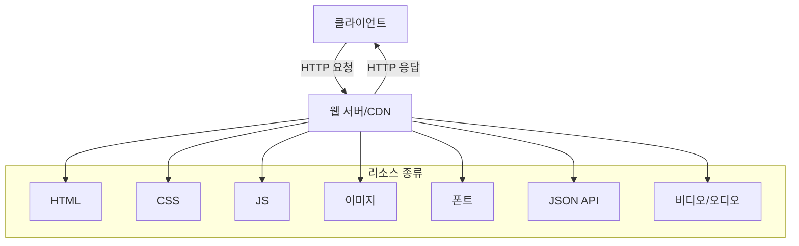
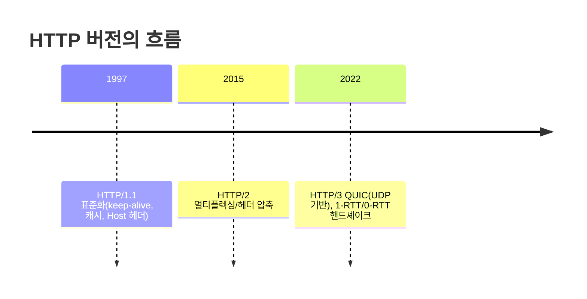
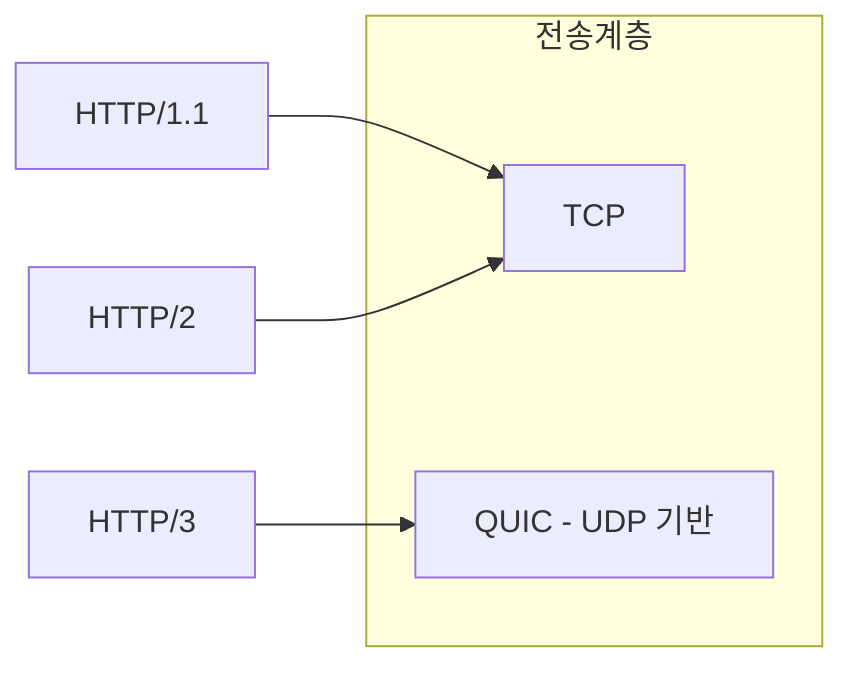

# Chapter 03 HTTP 기본

## 03-1 모든 것이 HTTP

### 개요
이 섹션에서는 "모든 것이 HTTP"라는 관점에서, 웹 문서부터 이미지, 폰트, 동영상 스트리밍, 그리고 API까지 현대 웹 트래픽의 대부분이 HTTP를 매개로 전달된다는 사실을 이해합니다. 또한 HTTP/1.1, HTTP/2, HTTP/3의 큰 흐름과 차이점을 비교하고, HTTP가 애플리케이션 계층에서 다양한 하위 전송(전송 계층/네트워크 계층)에 얽매이지 않는 프로토콜 독립성과 확장성을 어떻게 확보했는지 살펴봅니다.

학습 목표
- HTTP가 문서/리소스/데이터 전송의 범용 프로토콜로 사용되는 배경을 설명할 수 있다.
- HTTP/1.1, HTTP/2, HTTP/3의 핵심 차이를 간단히 비교할 수 있다.
- MIME 타입, 헤더 확장, 콘텐츠 협상 등 HTTP의 확장 메커니즘을 설명할 수 있다.
- 전송 계층(TCP/UDP) 변화에도 HTTP가 적응한 과정을 이해한다.

### 왜 "모든 것이 HTTP"인가
- 브라우저 중심 생태계: HTML/CSS/JS 뿐 아니라 이미지, 폰트, 비디오, WASM, JSON API까지 동일한 요청-응답 모델로 취급 가능
- 인프라/도구 생태계의 풍부함: 캐시, CDN, 로드밸런서, 관측(로그/트레이싱), 보안(WAF) 등 HTTP 표준 기반
- 방화벽/NAT 친화성: 표준 포트(80/443)와 광범위한 호환성

### HTTP/1.1 vs HTTP/2 vs HTTP/3 한눈 비교
- HTTP/1.1
  - 기본 지속 연결(keep-alive), 파이프라이닝 있었지만 HOL(head-of-line) 문제와 실무 채택 저조
  - 다수의 병렬 요청 위해 커넥션을 여러 개 여는 패턴이 흔함
- HTTP/2
  - 단일 TCP 연결에서 멀티플렉싱(동시 스트림), 헤더 압축(HPACK)
  - 서버 푸시가 도입되었으나 현재는 비권장 추세, preload 선호
- HTTP/3
  - 전송 계층을 QUIC(UDP 기반)으로 전환, 연결/핸드셰이크 지연 개선, 전송계층 HOL 차단 완화
  - 스트림 단위 독립 전송, 손실 시에도 다른 스트림 영향 최소화

### 프로토콜 독립성과 확장성
- 계층화된 설계
  - HTTP는 애플리케이션 계층에서 동작하며, 하위 전송(TCP/TLS/QUIC)의 변화에도 동일한 메시지 의미 체계를 유지
  - 예: HTTP/1.1/2는 TCP 위, HTTP/3는 QUIC(UDP 위)
- 확장 포인트
  - MIME 타입(Content-Type)으로 표현 포맷을 자유롭게 정의(HTML, JSON, 이미지, 비디오 등)
  - 헤더 확장: 신규 표준/커스텀 헤더로 기능 확장(Vary, Accept-*, Cache-Control 등)
  - 콘텐츠 협상: Accept/Accept-Language/Accept-Encoding으로 최적 표현 제공
  - 보안: TLS(HSTS, ALPN)와의 결합으로 전송 보안/버전 협상

### 스트리밍과 HTTP
- HLS/DASH 등 적응형 스트리밍은 세그먼트 파일과 인덱스(manifest)를 HTTP로 전송
- 범위 요청(Range)과 캐시/CDN 활용으로 대규모 전송 최적화
- WebRTC는 실시간 상호작용에 최적화된 별도 프로토콜이지만, VOD/라이브 대다수 분배는 여전히 HTTP 기반 세그먼트 전송이 주류

### HTTP는 상태와 무관한 전송의 그릇
- HTTP는 무상태(stateless) 요청-응답 프로토콜로, 상태 유지가 필요하면 쿠키/세션/토큰 등 상위 레이어에서 해결
- 메시지 포맷과 메서드, 헤더 조합으로 다양한 의미를 표현할 수 있으며, 리소스 중심 설계(URI)와 함께 광범위한 도메인에 적용 가능

### 6가지 키워드로 정리하는 핵심 포인트
1. **범용성**: HTML부터 API, 미디어까지 하나의 프로토콜(HTTP)로 전달된다.
2. **버전 발전**: 1.1 → 2 → 3으로 성능과 효율성, 지연 특성이 지속 개선되었다.
3. **전송 독립성**: HTTP/1.1/2는 TCP, HTTP/3는 QUIC(UDP) 위에서 동작한다.
4. **헤더/콘텐츠 협상**: MIME과 Accept-* 계열로 표현을 협상하고 확장한다.
5. **캐시/CDN 친화**: 표준 헤더와 범위 요청으로 대규모 전송을 최적화한다.
6. **무상태 기반 확장**: 상태는 상위 레이어에서 관리하며 HTTP는 전송의 그릇 역할을 한다.

### 확인 문제
1. 다음 중 "모든 것이 HTTP" 관점에 대한 설명으로 옳은 것은?
    - [ ] HTTP는 HTML과 CSS만 전송할 수 있으며 JSON과 이미지는 별도 프로토콜이 필요하다
    - [ ] 비디오는 항상 전용 스트리밍 프로토콜만으로 전송되며 HTTP로는 불가능하다
    - [ ] HTTP는 다양한 리소스(문서/이미지/폰트/JSON/비디오 세그먼트)를 동일한 요청-응답 모델로 전송할 수 있다
    - [ ] HTTP는 브라우저에서만 사용되며 API 통신에는 적합하지 않다

2. 다음 중 HTTP/1.1, HTTP/2, HTTP/3 비교에 대한 설명으로 옳은 것은?
    - [ ] HTTP/2는 여러 요청을 동시에 처리하려면 항상 여러 TCP 연결이 필요하다
    - [ ] HTTP/3는 QUIC(UDP 기반) 위에서 동작해 전송 계층 HOL 문제를 완화한다
    - [ ] HTTP/1.1은 기본적으로 연결 재사용을 지원하지 않는다
    - [ ] HTTP/2의 헤더 압축은 브라우저와 무관한 애플리케이션 로직으로 처리된다

3. 다음 중 옳은 것을 모두 고르시오. (복수 응답)
    - [ ] MIME 타입은 HTTP 메시지의 바디 포맷을 식별하는 데 사용된다
    - [ ] HTTP는 애플리케이션 계층 프로토콜로서 하위 전송 계층 교체에도 메시지 의미가 유지될 수 있다
    - [ ] 콘텐츠 협상은 Accept-* 헤더를 통해 클라이언트 선호 표현을 전달하는 메커니즘이다
    - [ ] HTTP는 상태 저장 프로토콜이므로 세션 유지를 자체적으로 보장한다
    - [ ] 범위 요청(Range)은 대용량 미디어 전송 최적화에 활용될 수 있다

> [정답 및 해설 보기](../answers_and_explanations.md#ans-03-1-모든-것이-http)
