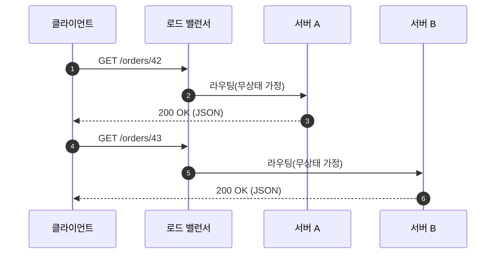
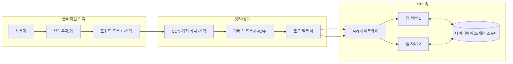

# Chapter 03 HTTP 기본

## 03-2 클라이언트 서버 구조

### 개요
이 섹션에서는 HTTP의 기본 전제인 클라이언트-서버 구조를 이해합니다. 사용자 인터페이스와 요청을 담당하는 클라이언트, 비즈니스 로직과 데이터 처리를 담당하는 서버의 역할을 구분하고, 왜 HTTP의 무상태(stateless) 특성이 확장성과 부하 분산에 유리한지 살펴봅니다. 또한 프록시(Proxy), 게이트웨이(Gateway), 로드 밸런서(Load Balancer)가 네트워크 경로에서 어떤 위치와 역할을 가지는지 다이어그램으로 정리합니다.

학습 목표
- 클라이언트와 서버의 역할을 명확히 설명할 수 있다.
- 무상태 통신이 확장성과 부하 분산에 기여하는 이유를 설명할 수 있다.
- 프록시, 게이트웨이, 로드 밸런서의 위치와 차이를 설명할 수 있다.

### 클라이언트와 서버의 역할 분리
- 클라이언트(Client): 사용자 인터페이스(UI) 제공, 사용자의 입력을 수집하여 서버에 요청 전송, 응답을 받아 렌더링/표시
- 서버(Server): 요청을 해석하고 비즈니스 로직 수행, 데이터 저장소와 연동, 응답 생성 및 반환
- 이점:
  - 관심사의 분리(Separation of Concerns): UI와 비즈니스 로직의 독립적 진화
  - 성능/확장성: 각 측면을 독립적으로 확장 가능(프론트엔드 스케일아웃, 백엔드 오토스케일 등)

### 무상태 통신과 확장성
- 무상태(Stateless): 각 요청은 필요한 모든 컨텍스트를 포함하고, 서버는 이전 요청의 상태에 의존하지 않음
- 장점:
  - 수평 확장 용이: 어느 서버 인스턴스가 응답해도 동일 결과를 보장 → 로드 밸런싱/오토스케일에 유리
  - 장애 격리: 특정 서버 장애 시 다른 서버로 트래픽 전환이 간단
  - 캐시 친화성: 응답을 중간 캐시/CDN에 저장해 부하 감소
- 주의:
  - 세션/상태가 꼭 필요하면 클라이언트 측 토큰(JWT 등) 또는 서버 외부 저장(세션 스토어/DB) 활용

### 프록시, 게이트웨이, 로드 밸런서의 위치
- 프록시(Proxy): 클라이언트 또는 서버를 대신하여 요청/응답을 중계
  - 포워드 프록시: 클라이언트 앞단(기업망/캐시/접근통제)
  - 리버스 프록시: 서버 앞단(보안/WAF/캐시/압축/SSL 종료)
- 게이트웨이(Gateway): 서로 다른 프로토콜/도메인 간의 변환/연계를 수행
  - 예: API 게이트웨이(인증/레이트리밋/라우팅), gRPC↔HTTP 변환, 레거시 시스템 연계
- 로드 밸런서(Load Balancer): 다수의 서버 인스턴스에 트래픽을 분산(라운드로빈/가중치/헬스체크)

### 언제 무엇을 쓰나
- 단순 서비스: 리버스 프록시(Nginx) + 애플리케이션 서버 → TLS 종료, 정적 캐시, 압축
- 대규모 트래픽: 로드 밸런서로 다수 인스턴스 분산, 오토스케일, 헬스체크
- 복합 백엔드: API 게이트웨이로 인증/인가, 라우팅, 레이트 리밋, 관측 통합
- 내부망 정책/성능: 포워드 프록시로 외부 접속 제어, 공용 캐시로 트래픽 절감

### 상태 관리 전략(간단 맛보기)
- 서버 세션: 서버 측 스토어에 세션 보관 → 스티키 세션 또는 공유 스토어 필요
- 토큰 기반: 클라이언트가 토큰(JWT 등)을 보유, 서버는 검증만 수행 → 무상태 성에 유리
- 하이브리드: 일부 상태는 외부 스토어(예: Redis)에 저장하여 서버 간 공유

### 6가지 키워드로 정리하는 핵심 포인트
1. **역할 분리**: 클라이언트는 UI/요청, 서버는 비즈니스/응답을 담당한다.
2. **무상태 확장성**: 요청 간 상태 의존을 제거하면 수평 확장이 쉬워진다.
3. **중간 계층**: 프록시/게이트웨이/로드 밸런서는 보안·성능·확장을 돕는다.
4. **캐시 친화**: 무상태와 리버스 프록시/CDN 캐시로 부하를 줄인다.
5. **세션 외부화**: 필요한 상태는 토큰/외부 스토어로 관리해 유연성을 높인다.
6. **관측/제어**: 엣지에서 인증, 레이트 리밋, 로깅을 표준화해 운영성을 높인다.

### 확인 문제
1. 클라이언트-서버 구조에 대한 설명으로 옳은 것은?
    - [ ] 클라이언트는 비즈니스 로직을, 서버는 UI를 주로 담당한다
    - [ ] 서버는 항상 클라이언트의 이전 요청 상태를 기억해야 한다
    - [ ] 클라이언트는 요청을 보내고 응답을 렌더링하며, 서버는 로직 처리와 데이터 연동을 담당한다
    - [ ] 클라이언트와 서버는 동일한 역할을 수행하므로 구분이 의미 없다

2. 무상태 통신과 확장성에 대한 설명으로 옳은 것은?
    - [ ] 무상태는 캐시 사용을 어렵게 만든다
    - [ ] 무상태는 어느 서버 인스턴스가 응답해도 되므로 로드 밸런싱에 유리하다
    - [ ] 무상태는 항상 인증이 불가능함을 의미한다
    - [ ] 무상태에서는 세션을 서버 메모리에만 저장해야 한다

3. 다음 중 프록시/게이트웨이/로드 밸런서에 대해 옳은 것을 모두 고르시오. (복수 응답)
    - [ ] 포워드 프록시는 보통 클라이언트 측에 위치해 외부 접속을 제어한다
    - [ ] 리버스 프록시는 서버 앞단에서 캐시, 압축, TLS 종료 등을 담당할 수 있다
    - [ ] 로드 밸런서는 여러 서버로 트래픽을 분산한다
    - [ ] 게이트웨이는 항상 동일 프로토콜 간 라우팅만 수행한다
    - [ ] API 게이트웨이는 인증/인가, 레이트 리밋, 라우팅 같은 기능을 제공할 수 있다

> [정답 및 해설 보기](../answers_and_explanations.md#ans-03-2-클라이언트-서버-구조)
