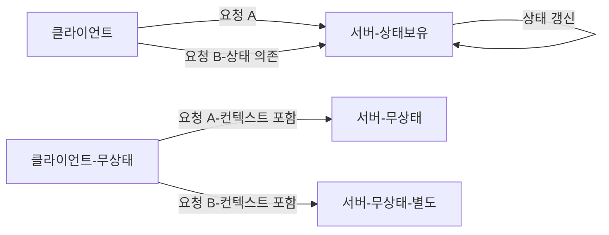
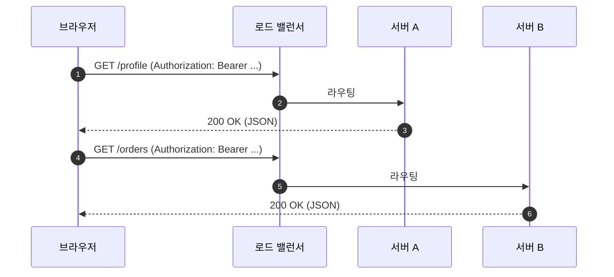
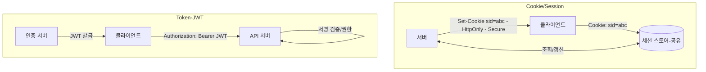

# Chapter 03 HTTP 기본

## 03-3 Stateful, Stateless

### 개요
이 섹션에서는 상태 유지(Stateful)와 비상태(Stateless)의 개념을 비교하고, HTTP가 기본적으로 무상태임이 무엇을 의미하는지, 그리고 실제 서비스에서 세션/쿠키/토큰(JWT 등)을 이용해 상태를 어떻게 관리하는지 학습합니다. 또한 확장성, 장애 복구, 캐시 적합성, 보안(CSRF, 세션 하이재킹, 토큰 회수)에 미치는 영향을 사례와 다이어그램으로 설명합니다.

학습 목표
- Stateful과 Stateless의 차이를 정의하고 사례로 설명할 수 있다.
- HTTP 무상태 특성이 확장성과 캐시 친화성에 주는 이점을 설명한다.
- 쿠키/세션/토큰의 동작 원리와 장단점을 비교한다.
- 스티키 세션 vs 세션 외부화(공유 스토어)의 트레이드오프를 설명한다.
- 보안 고려사항(SameSite, HttpOnly, 토큰 만료/회수)을 이해한다.

### Stateful vs Stateless 정의
- Stateful(상태 유지): 서버가 클라이언트의 과거 상호작용에 대한 상태를 메모리나 로컬 저장소에 보유하고, 이후 요청 처리 시 그 상태에 의존
  - 예: 서버 메모리에 로그인 세션을 저장하고, 동일 서버로만 라우팅해야 올바르게 동작
- Stateless(비상태): 각 요청이 처리에 필요한 모든 정보를 자급자족하고, 서버는 이전 요청의 상태를 기억하지 않음
  - 예: 토큰 기반 인증으로 요청마다 유효한 토큰을 제시, 어느 서버가 처리해도 동일 결과

### HTTP와 무상태
- HTTP는 기본적으로 무상태 요청-응답 프로토콜입니다. 즉, 프로토콜 자체는 클라이언트의 이전 요청 상태를 저장하지 않습니다.
- 상태가 필요할 때는 애플리케이션 레벨에서 별도 메커니즘(쿠키/세션/토큰/외부 저장소)을 사용합니다.
- 장점: 수평 확장, 장애 전환 단순화, 캐시 친화성(응답이 상태에 덜 의존)

### 상태 관리 수단 비교(쿠키/세션/토큰)
- 쿠키(Cookie): 클라이언트가 보관하는 키-값. 서버가 Set-Cookie로 설정, 이후 요청마다 자동 전송
  - 보안 속성: Secure, HttpOnly, SameSite
- 서버 세션(Server-side Session): 세션 ID만 쿠키에 보관, 실제 상태는 서버의 세션 스토어(메모리/Redis/DB)에 저장
  - 장점: 토큰 회수/무효화 용이, 세밀한 서버 제어
  - 단점: 스토어 필요, 스케일 시 스티키 세션 또는 공유 스토어 구성 필요
- 토큰(JWT 등): 상태 정보를 암호학적으로 서명해 토큰 자체에 포함, 서버는 검증만 수행(무상태)
  - 장점: 무상태 확장성, 별도 스토어 없이 검증 가능
  - 단점: 즉시 회수가 어렵고, 크기/노출 위험 관리 필요(짧은 만료, 블랙리스트/세션 토큰 하이브리드)

### 스티키 세션 vs 세션 외부화
- 스티키 세션(Sticky Session): 로드 밸런서가 같은 클라이언트 요청을 동일 서버로 라우팅
  - 장점: 구현 단순, 서버 로컬 메모리 세션 활용 가능
  - 단점: 특정 서버에 종속→불균형/장애 전환 어려움, 스케일/배포 탄력성 저해
- 세션 외부화(Shared Store): 세션을 외부 공유 저장소(예: Redis)에 저장해 어느 서버에서도 조회
  - 장점: 무상태에 가까운 확장성, 장애 전환 용이
  - 단점: 외부 저장소 운영 비용/복잡성, 네트워크 지연

### 캐시/장애 복구/확장성/보안 관점 비교
- 확장성: Stateless ≥ 세션 외부화 > 스티키 세션 > 로컬 상태 강한 Stateful
- 장애 복구: Stateless/세션 외부화 유리, 스티키 세션은 세션 손실/재로그인 이슈
- 캐시 적합성: Stateless가 가장 캐시 친화적(응답 결정 요소가 명시적)
- 보안: 
  - 쿠키: SameSite=Lax/Strict로 CSRF 위험 완화, HttpOnly로 XSS에 의한 스크립트 접근 차단
  - 토큰: 짧은 만료, 회전(rotation), 스코프 최소화, 전송은 항상 HTTPS
  - 세션 하이재킹/고정(session fixation) 방지: 로그인/권한 상승 시 세션 재발급

### 7가지 키워드로 정리하는 핵심 포인트
1. **정의 차이**: Stateful은 서버가 과거 상태에 의존, Stateless는 요청이 모든 컨텍스트를 포함한다.
2. **HTTP 무상태**: 프로토콜은 상태를 보관하지 않으며, 상태는 애플리케이션 레벨에서 관리한다.
3. **확장성 우위**: Stateless가 수평 확장/장애 전환/배포에 가장 유리하다.
4. **세션 외부화**: 필요 상태는 외부 스토어로 공유해 무상태에 가깝게 만든다.
5. **토큰 기반**: 서버 검증만으로 확장되지만, 회수/만료/크기/보안을 설계해야 한다.
6. **캐시 친화**: 무상태 설계는 CDN/프록시 캐시 활용에 유리하다.
7. **보안 기본기**: SameSite/HttpOnly/Secure, 짧은 만료, HTTPS, 세션 재발급은 필수 고려.

### 확인 문제
1. 다음 중 Stateless 통신의 장점으로 옳은 것은?
    - [ ] 특정 서버 인스턴스에 상태가 묶여 장애 전환이 쉬워진다
    - [ ] 요청마다 필요한 컨텍스트를 포함하므로 어느 서버가 처리해도 일관된다
    - [ ] 캐시가 어려워 CDN 활용이 제한된다
    - [ ] 배포 시 세션 유실 위험이 커진다

2. 다음 중 상태 관리 방식과 설명의 연결이 올바른 것은?
    - [ ] 서버 세션: 토큰 자체에 모든 상태가 들어 있으며 서버는 검증만 수행한다
    - [ ] JWT: 즉시 회수가 쉽고 중앙 저장소가 필수다
    - [ ] 스티키 세션: 동일 사용자를 항상 동일 서버로 라우팅하는 방식이다
    - [ ] 세션 외부화: 세션을 각 서버의 로컬 메모리에 분산 저장한다

3. 다음 중 옳은 것을 모두 고르시오. (복수 응답)
    - [ ] SameSite 쿠키 설정은 CSRF 위험을 줄이는 데 도움 된다
    - [ ] HttpOnly 속성은 자바스크립트에서 쿠키 접근을 차단해 XSS 피해 완화를 돕는다
    - [ ] Stateless 설계는 캐시 친화적이다
    - [ ] 스티키 세션은 수평 확장성과 장애 전환에 항상 유리하다
    - [ ] 토큰 기반 인증은 짧은 만료/회전 전략과 함께 사용할 수 있다

> [정답 및 해설 보기](../answers_and_explanations.md#ans-03-3-stateful-stateless)
