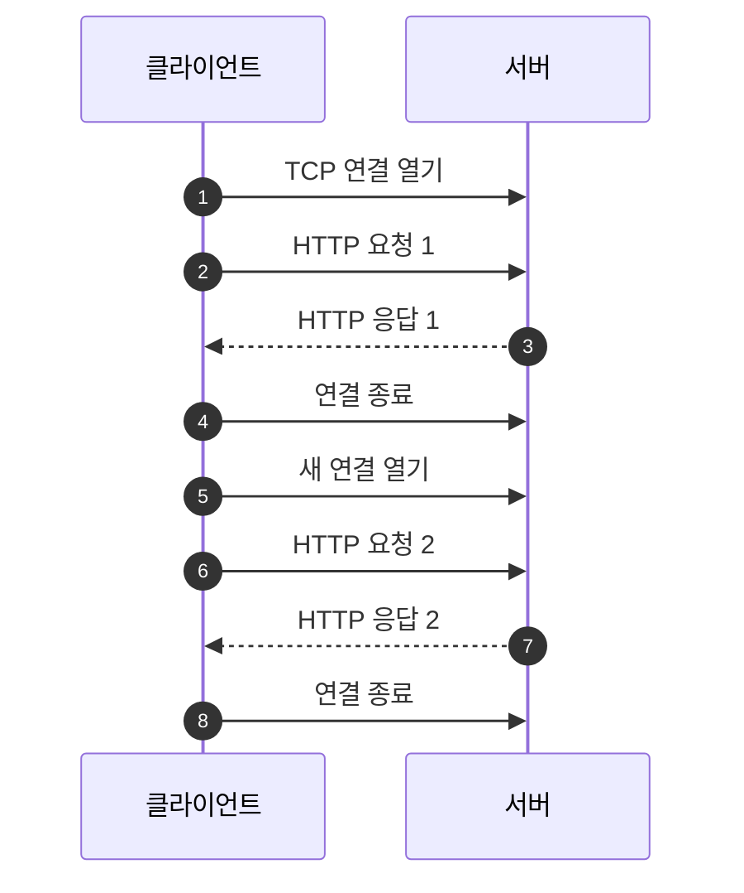
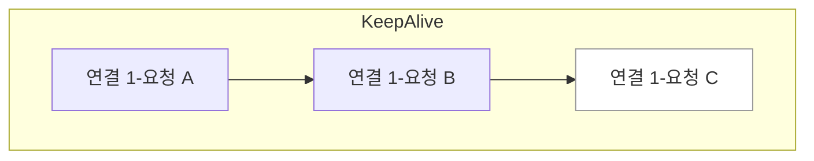
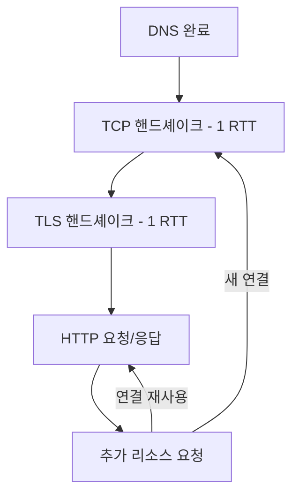
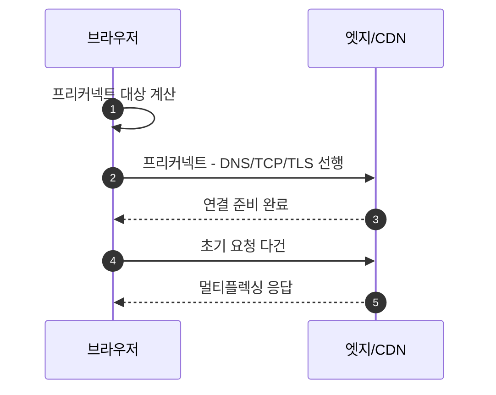

# Chapter 03 HTTP 기본

## 03-4 비 연결성(connectionless)

### 개요
이 섹션에서는 HTTP의 "비 연결성(connectionless)" 특성이 의미하는 바를 정확히 이해합니다. 전송 계층의 TCP는 연결지향(connection-oriented)이지만, HTTP 애플리케이션 계층은 요청-응답 단위로 상태를 유지하지 않으며 전통적으로 요청 후 연결을 끊는 모델을 가정했습니다. 현대의 HTTP/1.1 keep-alive, 커넥션 재사용, HTTP/2 멀티플렉싱, HTTP/3(QUIC)에서의 연결과 스트림 개념을 연결 비용(RTT, TLS, 슬로우 스타트) 관점에서 설명하고, 실무에서의 커넥션 관리와 성능 최적화 포인트를 정리합니다.

학습 목표
- HTTP의 비 연결성 의미와 TCP의 연결지향 특성의 관계를 설명할 수 있다.
- HTTP/1.0 vs HTTP/1.1 keep-alive 차이와 연결 재사용의 필요성을 이해한다.
- HTTP/2 멀티플렉싱과 HTTP/3(QUIC)의 스트림이 지연과 HOL 문제에 미치는 영향을 설명한다.
- 연결 비용(RTT, TLS 핸드셰이크, TCP 슬로우 스타트)과 최적화 전략(preconnect, 커넥션 풀)을 설명한다.

### HTTP의 비 연결성은 무엇을 의미하나
- 애플리케이션 계층인 HTTP는 요청-응답 한 트랜잭션을 독립적으로 처리하며, 프로토콜 자체가 이전 요청의 상태를 서버에 보관하지 않는다(무상태).
- 역사적으로 HTTP/1.0은 요청마다 TCP 연결을 열고 응답 후 바로 닫는 패턴이 일반적이었다 → 연결 설정 비용 증가.
- TCP 자체는 연결지향이지만, HTTP가 연결을 오래 유지하지 않아도 동작 가능하다는 의미에서 "비 연결성"으로 설명해왔다.

### HTTP/1.1의 지속 연결과 재사용(keep-alive)
- HTTP/1.1은 기본 지속 연결(persistent connections)을 도입하여 다수 요청을 동일 연결에서 순차적으로 처리 가능.
- 이점: TCP/TLS 핸드셰이크 비용 절감, TCP 슬로우 스타트 재시작 감소, 헤더 오버헤드 상대 감소.
- 주의: 동일 연결에서의 파이프라이닝은 HOL(Head-of-line) 블로킹 문제로 실무 채택이 낮았고, 브라우저는 보통 안전한 순차 처리 및 다중 연결 병행을 사용.

### HTTP/2 멀티플렉싱과 HTTP/3의 스트림
- HTTP/2: 하나의 TCP 연결에서 여러 스트림을 동시에 전송(멀티플렉싱). 헤더 압축(HPACK) 제공.
  - 한계: 전송 계층(TCP) 레벨의 패킷 손실은 연결 전체 HOL 블로킹 유발.
- HTTP/3: QUIC(UDP 기반) 위에서 동작, 스트림이 전송 계층에서 독립 → 일부 손실이 다른 스트림에 덜 영향을 준다. 핸드셰이크 1-RTT, 재방문 0-RTT 가능.

### 연결 비용과 지연 시간
- TCP 3-way 핸드셰이크: 최소 1 RTT.
- TLS 핸드셰이크: 1.2는 추가 RTT, 1.3은 1-RTT(재방문 0-RTT 가능, 재주입 위험 고려).
- TCP 슬로우 스타트: 새로운 연결은 초기 윈도우가 작아 전송량이 점진적으로 증가.
- 결과: 짧은 수명의 다수 연결은 지연과 오버헤드를 키움 → 연결 재사용과 멀티플렉싱이 중요.

### 실무에서의 연결 관리 포인트
- 브라우저 한 오리진당 연결 수 제한(HTTP/1.1 기준 역사적으로 6 내외) → 스프라이트/도메인 샤딩은 HTTP/2 시대엔 비권장.
- 서버 설정: keepalive 타임아웃, 최대 동시 연결, 큐 길이 튜닝.
- 클라이언트/백엔드: 커넥션 풀 사용(HTTP/1.1 재사용, HTTP/2 단일 커넥션 우선), 타임아웃/최대 유휴 시간 설정.
- 프리커넥트(preconnect), dns-prefetch로 초기 지연 감소. H/2/H/3 활성화로 멀티플렉싱/지연 개선.

### 7가지 키워드로 정리하는 핵심 포인트
1. **비 연결성 의미**: HTTP는 요청-응답 단위로 상태를 보관하지 않으며 연결 유지가 필수는 아니다.
2. **TCP와의 관계**: TCP는 연결지향이지만 HTTP가 연결을 짧게 가져가도 동작한다.
3. **keep-alive**: HTTP/1.1의 지속 연결로 핸드셰이크/슬로우 스타트 비용을 절감한다.
4. **멀티플렉싱**: HTTP/2는 단일 연결에서 동시 스트림을 처리한다.
5. **QUIC 스트림**: HTTP/3는 전송계층 HOL 문제를 완화하고 핸드셰이크 지연을 줄인다.
6. **연결 비용**: RTT, TLS, 슬로우 스타트로 인해 새 연결은 비싸다 → 재사용이 중요.
7. **실무 최적화**: 커넥션 풀/타임아웃/프리커넥트/H2/H3 적용으로 지연을 줄인다.

### 확인 문제
1. HTTP의 "비 연결성"에 대한 설명으로 옳은 것은?
    - [ ] TCP는 비연결형이므로 HTTP도 비연결형이 된다
    - [ ] HTTP는 프로토콜 차원에서 항상 연결을 유지해야 한다
    - [ ] HTTP는 요청-응답 단위로 상태를 보관하지 않으며, 연결은 재사용할 수도 끊을 수도 있다
    - [ ] HTTP/1.0은 기본적으로 멀티플렉싱을 지원한다

2. 다음 중 연결 비용과 최적화에 대한 설명으로 옳은 것은?
    - [ ] TLS 1.3은 초기 핸드셰이크에 추가 RTT를 요구해 항상 느리다
    - [ ] 새로운 TCP 연결은 슬로우 스타트로 인해 초반 전송 윈도우가 작다
    - [ ] 프리커넥트는 DNS만 미리 수행한다
    - [ ] HTTP/1.1에서는 keep-alive가 불가능하다

3. 다음 중 옳은 것을 모두 고르시오. (복수 응답)
    - [ ] HTTP/2는 하나의 TCP 연결에서 여러 요청을 동시 전송할 수 있다
    - [ ] HTTP/3는 QUIC 기반으로 스트림 간 독립성이 높다
    - [ ] 도메인 샤딩은 HTTP/2 환경에서도 일반적으로 권장된다
    - [ ] 연결 재사용은 TLS 핸드셰이크 비용을 줄이는 데 도움이 된다
    - [ ] 비 연결성은 서버가 세션 상태를 반드시 메모리에 저장함을 의미한다

> [정답 및 해설 보기](../answers_and_explanations.md#ans-03-4-비-연결성-connectionless)
