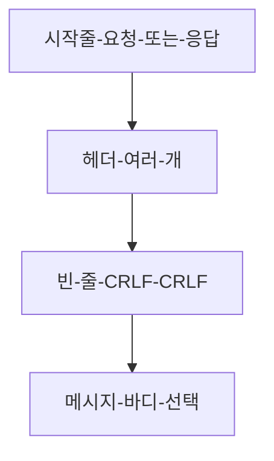
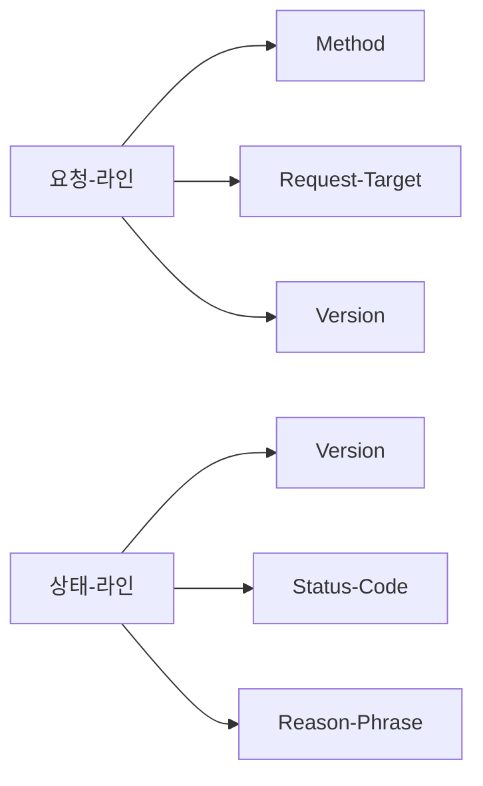
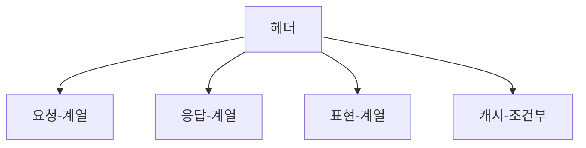
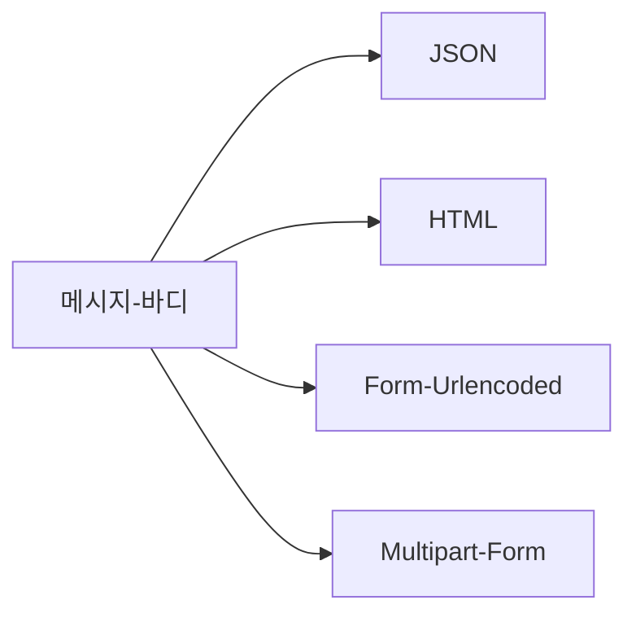
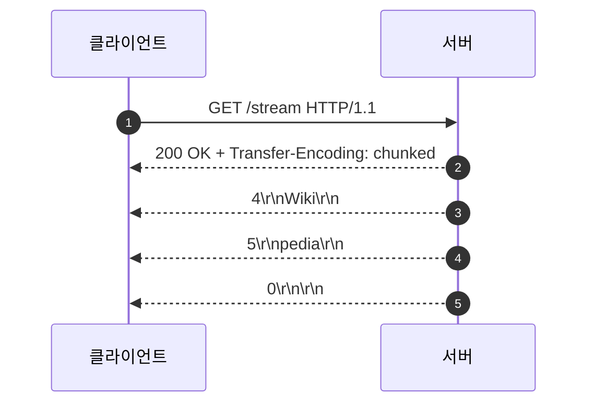

# Chapter 03 HTTP 기본

## 03-5 HTTP 메시지

### 개요
이 섹션에서는 HTTP 메시지의 기본 구조를 학습합니다. 요청과 응답 메시지 모두 "시작줄(Start Line) → 헤더(Headers) → 바디(Body)"로 구성되며, 요청 라인(method, request-target, version)과 상태라인(version, status code, reason phrase)의 의미를 이해합니다. 또한 대표적인 헤더 예시와 메시지 바디 포맷(JSON, HTML, Form-urlencoded, Multipart)을 살펴보고, 전송 방식(Content-Length, chunked)과 CRLF 기반 메시지 구분 규칙까지 짚어봅니다.

학습 목표
- HTTP 요청과 응답 메시지의 공통 구조를 설명할 수 있다.
- 요청 라인과 상태라인의 구성 요소와 의미를 구분할 수 있다.
- 주요 헤더의 역할과 분류를 예시로 설명할 수 있다.
- 메시지 바디 포맷과 전송 방식(Content-Length, chunked)을 구분할 수 있다.

### HTTP 메시지의 공통 구조
- 공통 골격: 시작줄 → 헤더들 → 빈 줄(CRLF) → 바디(optional)
- 요청과 응답의 차이는 시작줄의 형태에 있다.

```text
요청:
<method> <request-target> HTTP/<version>\r\n
<header-name>: <value>\r\n
...\r\n
\r\n
[message-body]

응답:
HTTP/<version> <status-code> <reason-phrase>\r\n
<header-name>: <value>\r\n
...\r\n
\r\n
[message-body]
```



- CRLF: 각 줄은 \r\n으로 끝나며, 헤더 종료는 빈 줄(CRLF 2회 연속)로 표시

### 요청 라인과 상태 라인
- 요청 라인(Request Line)
  - Method: GET, POST, PUT, PATCH, DELETE, HEAD, OPTIONS 등
  - Request-target: 보통 origin-form인 경로와 쿼리("/path?x=1"), 프록시 환경에서는 absolute-form 사용 가능
  - HTTP Version: HTTP/1.1, HTTP/2, HTTP/3(문자열 표현은 주로 1.1에서 의미 있음)
- 상태 라인(Status Line)
  - Version: HTTP/1.1 등
  - Status Code: 200, 201, 204, 301, 302, 304, 400, 401, 403, 404, 500, 503 등
  - Reason phrase: 사람 읽기 용 보조 문구. 최신 표준에서는 의미적 의존이 줄어드는 추세



예시: 간단한 GET 요청
```
GET /products/123?lang=ko HTTP/1.1
Host: www.example.com
User-Agent: DemoBrowser/1.0
Accept: text/html,application/xhtml+xml
Accept-Language: ko-KR,ko;q=0.9
Connection: keep-alive

```

예시: 간단한 응답
```
HTTP/1.1 200 OK
Date: Tue, 09 Sep 2025 07:00:00 GMT
Content-Type: text/html; charset=utf-8
Content-Length: 13

Hello, world!
```

### 대표적인 헤더 분류와 예시
- 요청 전용 또는 주로 요청에서 사용: Host, User-Agent, Accept, Accept-Language, Accept-Encoding, Authorization, Cookie, Referer, Origin
- 응답 전용 또는 주로 응답에서 사용: Server, Date, Set-Cookie, Location, WWW-Authenticate, Retry-After
- 표현 관련: Content-Type, Content-Length, Content-Encoding, Content-Language
- 캐시/조건부: Cache-Control, Expires, ETag, Last-Modified, If-None-Match, If-Modified-Since



주의: HTTP 헤더 이름은 대소문자 비민감하지만, 통상적으로 하이픈 구분 대문자 형태를 사용한다.

### 메시지 바디 포맷과 폼 전송
- JSON: Content-Type: application/json
- HTML: Content-Type: text/html; charset=utf-8
- Form-urlencoded: Content-Type: application/x-www-form-urlencoded
  - 바디 예: `name=lee&age=20`
- Multipart form-data: 파일 업로드 등 복합 데이터 전송에 사용
  - Content-Type: multipart/form-data; boundary=----WebKitFormBoundaryX



### 메시지 길이와 전송 방식
- Content-Length: 바디의 길이를 바이트 단위로 명시
- Transfer-Encoding: chunked
  - 길이를 사전에 알기 어렵거나 스트리밍 응답 시 청크 단위로 전송
  - 청크 형식: `<hex-length>\r\n<data>\r\n ... 0\r\n\r\n`
- HTTP/2 이상에서는 프레이밍이 프로토콜 레벨에서 처리되어 Transfer-Encoding 헤더 대신 스트림 프레이밍으로 관리됨



### 프로토콜 버전과 메시지 표현
- HTTP/1.1: 텍스트 기반 시작줄과 헤더, CRLF로 구분
- HTTP/2: 바이너리 프레이밍, 헤더 압축(HPACK), 시작줄은 개념적으로 존재하나 전송 형식 다름
- HTTP/3: QUIC 기반 바이너리 프레이밍, 헤더 압축(QPACK)
- 의미 체계는 버전 간 일관되게 유지된다(메서드, 상태코드, 헤더 의미)

### 7가지 키워드로 정리하는 핵심 포인트
1. **구조**: 시작줄 → 헤더 → 빈 줄 → 바디가 기본 골격이다.
2. **요청라인**: Method, Request-Target, Version으로 구성된다.
3. **상태라인**: Version, Status Code, Reason Phrase로 구성된다.
4. **헤더 분류**: 요청, 응답, 표현, 캐시/조건부 등으로 나눌 수 있다.
5. **바디 포맷**: JSON, HTML, Form-urlencoded, Multipart 등을 Content-Type으로 식별한다.
6. **전송 방식**: Content-Length 또는 chunked, H2/H3에서는 프레이밍에 의해 관리된다.
7. **CRLF 규칙**: 헤더 종료는 빈 줄로 표시되며 줄 끝은 CRLF로 구분한다.

### 확인 문제
1. HTTP 메시지 구조에 대한 설명으로 옳은 것은?
    - [ ] 요청과 응답 모두 헤더 없이 바디만으로 구성된다
    - [ ] 헤더 종료는 한 개의 LF로 표시하며 CR은 사용하지 않는다
    - [ ] 시작줄 다음에는 헤더들이 오고, 빈 줄 이후에 바디가 온다
    - [ ] 요청의 시작줄은 상태코드로 시작한다

2. 다음 중 요청 라인과 상태 라인에 대한 설명이 옳은 것은?
    - [ ] 요청 라인은 Version Status-Code Reason-Phrase 순서로 구성된다
    - [ ] 상태 라인은 Method Request-Target Version 순서로 구성된다
    - [ ] 요청 라인의 request-target은 보통 origin-form이며 경로와 쿼리를 포함할 수 있다
    - [ ] 상태 라인의 Reason Phrase는 필수이며 의미 해석에 반드시 사용된다

3. 다음 중 메시지 바디 전송과 관련하여 옳은 것을 모두 고르시오. (복수 응답)
    - [ ] Content-Length는 바디의 바이트 길이를 나타낸다
    - [ ] Transfer-Encoding: chunked는 바디 길이를 모를 때 청크로 전송할 수 있게 한다
    - [ ] HTTP/2에서도 반드시 Transfer-Encoding 헤더로 청크를 표시해야 한다
    - [ ] application/x-www-form-urlencoded는 키-값 쌍을 `&`로 연결해 전송한다
    - [ ] multipart/form-data는 파일 업로드에 자주 사용된다

> [정답 및 해설 보기](../answers_and_explanations.md#ans-03-5-http-메시지)
