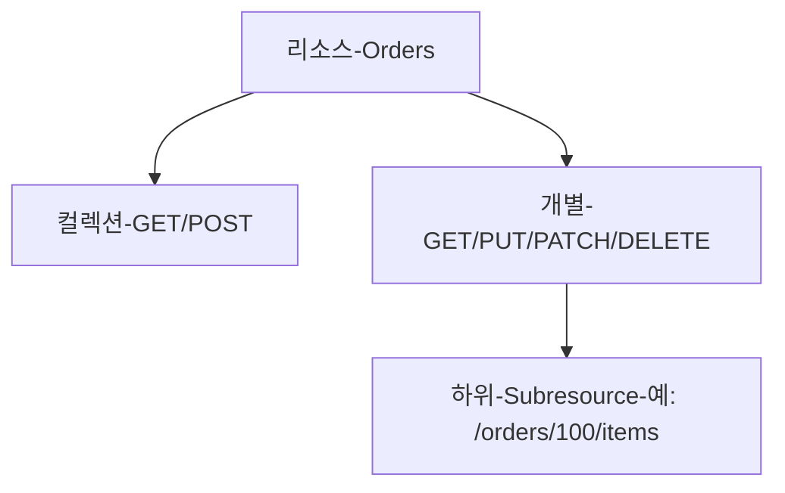
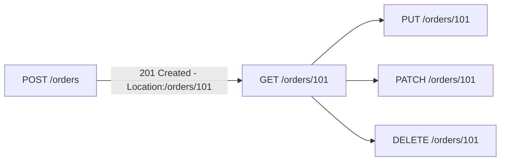
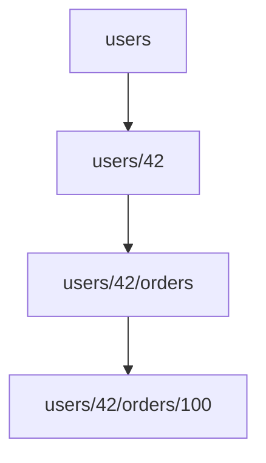
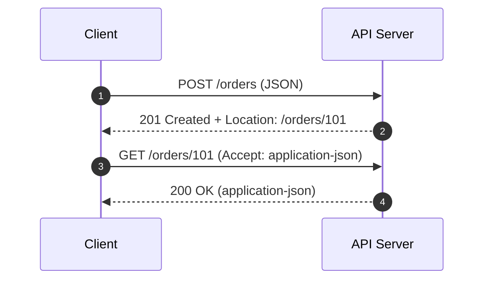

# Chapter 04 HTTP 메서드

## 04-1 HTTP API를 만들어보자

### 개요
이 섹션에서는 HTTP로 API를 설계하고 만드는 기본 방법을 학습합니다. 리소스 중심 설계(Resource-Oriented Design)의 핵심은 “URI는 명사, 행위는 메서드”로 구분하는 것입니다. 컬렉션과 개별 리소스, 하위 리소스, 상태 전이를 HTTP 메서드와 상태코드로 표현하는 법을 예제 중심으로 정리합니다. 또한 버저닝, 문서화, 예측 가능한 응답 포맷과 오류 처리 규약을 소개합니다.

학습 목표
- 리소스 중심 설계의 원칙(URI는 명사, 행위는 메서드)을 설명할 수 있다.
- 컬렉션/개별/하위 리소스 URI 패턴을 적용할 수 있다.
- CRUD 동작을 표준 HTTP 메서드/상태코드에 매핑할 수 있다.
- 엔드포인트 버저닝, 문서화, 일관된 오류 응답 규약을 제시할 수 있다.

### 리소스 중심 설계의 기본 원칙
- URI는 리소스(명사)를 식별한다: `/orders`, `/orders/100`, `/users/42/orders`
- 행위는 HTTP 메서드로 표현한다: GET, POST, PUT, PATCH, DELETE
- 서버 동작의 의미는 상태코드와 헤더로 전달한다: 201 Created + Location, 204 No Content 등

### 컬렉션과 개별 리소스 패턴
- 컬렉션(복수형): `/orders`
  - GET `/orders` → 리스트 조회(필터/정렬/페이지네이션은 쿼리)
  - POST `/orders` → 새 주문 생성(201 Created, Location: /orders/{id})
- 개별(식별자): `/orders/{id}`
  - GET `/orders/100` → 단건 조회
  - PUT `/orders/100` → 전체 교체(멱등), 리소스가 없으면 생성 허용 여부는 정책에 따름
  - PATCH `/orders/100` → 부분 변경(멱등성 보장 아님)
  - DELETE `/orders/100` → 삭제(멱등 기대)

### 하위 리소스와 관계 표현
- 계층 구조를 URI로 표현:
  - `/users/42/orders` → 사용자 42의 주문 컬렉션
  - `/users/42/orders/100` → 해당 사용자의 특정 주문
- 관계가 복잡해지면 쿼리/필터로 표현하고, 지나친 중첩은 피한다(`/a/b/c/d` 과도한 깊이 지양)

### 상태 전이와 커맨드 표현
- 순수 CRUD 외의 “행위”는 두 가지 접근이 있다:
  1) 상태 전이를 자원 갱신으로 표현: `PATCH /orders/100` 바디: `{ status: "paid" }`
  2) 액션 컬렉션을 별도 엔드포인트로: `POST /orders/100/actions:pay` 또는 `POST /orders/100:pay`
- 멱등성/캐시성/감사 로깅 등을 고려해 일관된 규칙을 조직 차원에서 정의한다.

### 요청/응답 포맷과 헤더
- JSON을 기본 포맷으로: `Content-Type: application/json`, `Accept: application/json`
- 생성 성공: 201 Created, Location 헤더로 새 리소스 URI 제공
- 변경 성공: 200 OK(updated)/204 No Content, 필요 시 ETag/If-Match로 병행 제어
- 목록 응답: 페이징 메타데이터를 포함(page, size, total 등) 또는 Link 헤더(rel=next, prev)

### 오류 응답 규약 제안(예시)
- 에러 바디 예: `{ "error": { "code": "ORDER_NOT_FOUND", "message": "...", "details": {...} } }`
- 상태코드 매핑 예: 400(검증 실패), 401/403(인증/인가), 404(없음), 409(중복/충돌), 422(처리 불가), 429(과도한 요청)
- 추적성: `Trace-Id`/`Correlation-Id` 헤더로 분산 추적 연계

### 버저닝과 문서화
- 버전 표기
  - URI 버전 접두사: `/v1/`(명확, 캐시/라우팅 용이)
  - 헤더/미디어 타입 버전: `Accept: application-vnd.example.orders-v1+json`(URI 깔끔, 구현 복잡)
- 문서화
  - OpenAPI(Swagger) 스펙으로 스키마/예제/응답 코드 정의
  - 예제 기반 문서화와 샘플 요청/응답 제공

### 7가지 키워드로 정리하는 핵심 포인트
1. **명사형 URI**: 리소스를 명사로 식별하고 행위는 메서드로 표현한다.
2. **컬렉션/개별**: `/resources` 와 `/resources/{id}` 패턴을 일관되게 사용한다.
3. **CRUD 매핑**: POST-생성, GET-조회, PUT-전체 교체, PATCH-부분 변경, DELETE-삭제.
4. **상태코드/헤더**: 201+Location, 200/204, ETag/If-Match 등 표준을 활용한다.
5. **하위 리소스**: 계층 관계를 적절히 표현하되 과도한 중첩은 피한다.
6. **오류 규약**: 일관된 에러 포맷과 상태코드 매핑을 정한다.
7. **버저닝/문서화**: /v1 또는 미디어타입 버전과 OpenAPI로 문서화한다.

### 확인 문제
1. 다음 중 리소스 중심 설계의 원칙으로 옳은 것은?
    - [ ] URI는 동사로 행위를 표현하고, 메서드는 모두 GET으로 통일한다
    - [ ] URI는 명사로 리소스를 식별하고, 행위는 HTTP 메서드로 구분한다
    - [ ] 모든 생성은 PUT을 사용해야 하며 POST는 비권장이다
    - [ ] 상태 전이는 URI에 액션을 쿼리스트링으로 항상 표기해야 한다

2. 다음 중 CRUD와 HTTP 메서드 매핑으로 가장 적절한 것은?
    - [ ] 생성-GET, 조회-POST, 전체 교체-DELETE, 삭제-PUT
    - [ ] 생성-POST, 조회-GET, 전체 교체-PUT, 삭제-DELETE
    - [ ] 생성-PATCH, 조회-OPTIONS, 부분 변경-DELETE, 삭제-PUT
    - [ ] 생성-POST, 조회-GET, 부분 변경-DELETE, 삭제-PATCH

3. 다음 중 옳은 것을 모두 고르시오. (복수 응답)
    - [ ] 새 리소스 생성 성공 시 201 Created와 Location 헤더를 보낼 수 있다
    - [ ] PUT은 보통 전체 교체 의미이며 멱등적으로 동작하는 것이 기대된다
    - [ ] PATCH는 항상 멱등성을 보장한다
    - [ ] 컬렉션은 보통 복수형 URI로 표현하며, 필터/정렬은 쿼리에 둔다
    - [ ] 버저닝은 항상 URI 접두사만이 정답이다

> [정답 및 해설 보기](../answers_and_explanations.md#ans-04-1-http-api를-만들어보자)
