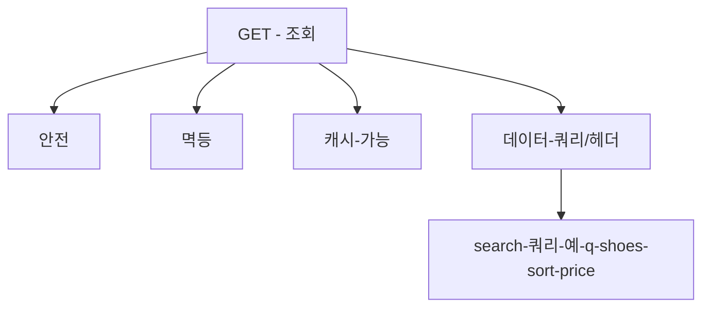
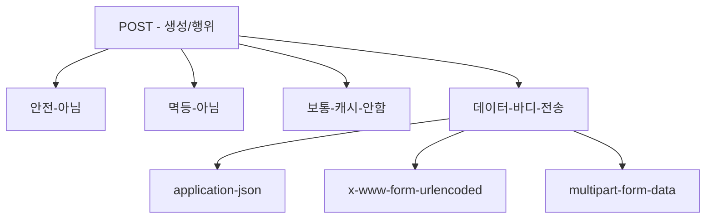
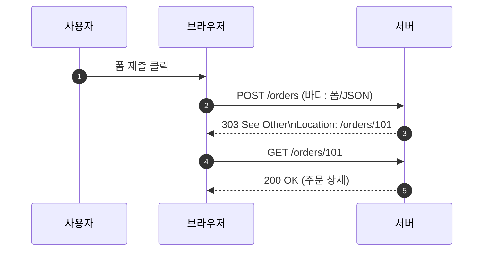
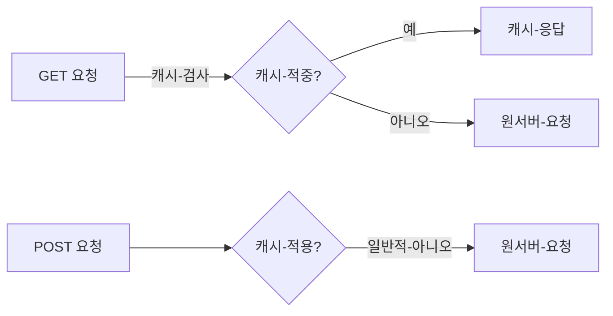

# Chapter 04 HTTP 메서드

## 04-2 HTTP 메서드 - GET, POST

### 개요
이 섹션에서는 가장 많이 사용하는 두 가지 HTTP 메서드인 GET과 POST의 의미, 속성(안전성, 멱등성, 캐시 가능성), 브라우저/프록시 캐시 동작 차이, 데이터 전송 방식과 보안/성능 관점의 주의점을 학습합니다. 또한 POST-Redirect-GET(PRG) 패턴과 폼 전송, JSON 전송 시의 실무 가이드를 다룹니다.

학습 목표
- GET과 POST의 의미와 표준 속성을 설명할 수 있다.
- 캐시/브라우저 동작, 재시도/중복 제출 위험, 링크 가능성 등 차이를 설명할 수 있다.
- 폼 전송과 JSON 전송에서의 적절한 메서드/헤더 사용법을 제시할 수 있다.
- POST-Redirect-GET 패턴의 목적과 동작을 설명할 수 있다.

### GET: 조회에 적합한 안전하고 멱등적인 메서드
- 의미: 서버 상태를 변경하지 않고 리소스를 “조회”한다.
- 안전(Safe): 서버의 가시적 상태를 변경하지 않는 것이 원칙.
- 멱등(Idempotent): 동일 요청을 여러 번 보내도 결과 상태가 동일하다(응답 본문/헤더는 달라질 수 있음). 
- 캐시 가능(Cacheable): 조건 충족 시 브라우저/프록시/CDN에서 캐시 가능.
- 데이터 전달: 주로 쿼리 파라미터와 헤더를 사용(메시지 바디는 표준적으로 금지되진 않으나 호환성/중개자 문제로 비권장).
- 링크/북마크: URL만으로 표현되어 공유/즐겨찾기에 유리.

### POST: 생성/행위 트리거에 적합, 멱등 아님
- 의미: 서버에 “새 리소스 생성” 또는 특정 행위를 트리거(명령)한다.
- 안전 아님: 서버 상태 변경이 일반적.
- 멱등 아님: 동일 요청을 반복하면 여러 번 효과가 발생할 수 있음(중복 생성 등).
- 캐시 기본 불가: 일반적으로 캐시하지 않음(명시적으로 Cache-Control 허용 및 조건 충족 시 일부 캐시 가능 표준이 있으나 실무에서 드묾).
- 데이터 전달: 메시지 바디에 폼/JSON/멀티파트 등 다양한 표현 전송.

### POST-Redirect-GET(PRG) 패턴
- 목적: 폼 재제출 방지, 새로고침/뒤로가기 시 중복 제출로 인한 문제 예방.
- 흐름: 사용자가 POST로 제출 → 서버가 처리 후 303 See Other(또는 302/303/303 계열)로 리디렉션 → 클라이언트가 GET으로 결과 페이지를 요청.
- 이점: 결과 페이지는 GET이므로 캐싱/북마크/새로고침이 안전.

### 캐시 동작 차이: GET vs POST
- GET: 기본적으로 캐시 가능. 응답에 Cache-Control/ETag/Last-Modified가 있으면 브라우저/프록시/CDN이 적극 활용.
- POST: 기본적으로 캐시하지 않음. 일부 표준 조건에서 캐시될 수 있으나 브라우저/프록시 호환성과 의미상 안전성 문제로 일반적으로 캐시 미적용으로 간주.

### 데이터 전송과 보안/실무 주의
- 민감 데이터는 GET 쿼리에 넣지 않는다(로그/북마크/레퍼러 노출 위험). HTTPS라도 URL 기록/공유 위험 존재.
- 대용량/복합 데이터는 POST 바디로 전송.
- 폼 전송
  - application-x-www-form-urlencoded: 단순 키-값.
  - multipart-form-data: 파일 업로드/복합 데이터.
- JSON 전송
  - Content-Type: application/json, Accept: application/json 권장.
- 재시도/중복 제출
  - POST는 멱등이 아니므로 클라이언트/중간자 자동 재시도에 주의 → 서버에서 중복 방지 키(idempotency-key) 전략 고려.

### 7가지 키워드로 정리하는 핵심 포인트
1. **GET=조회**: 안전/멱등/캐시 가능. 데이터는 주로 쿼리/헤더. 
2. **POST=생성/행위**: 안전 아님/멱등 아님/보통 캐시 안 함. 데이터는 바디.
3. **PRG 패턴**: POST 처리 후 303으로 리디렉션 → GET 결과 페이지.
4. **캐시 차이**: GET은 캐시 우선, POST는 기본 캐시 비적용.
5. **보안 주의**: 민감 데이터는 URL에 두지 말고 바디/헤더 사용.
6. **폼/JSON**: 폼은 form-urlencoded/multipart, API는 JSON 권장.
7. **중복 방지**: Idempotency-Key 등으로 POST 중복 제출 방지.

### 확인 문제
1. 다음 중 GET 메서드의 속성에 대한 설명으로 옳은 것은?
    - [ ] 안전하지 않으며 서버 상태를 변경한다
    - [ ] 멱등이 아니며 동일 요청 반복 시 다른 상태가 된다
    - [ ] 기본적으로 캐시 가능하며 조회에 적합하다
    - [ ] URL로 표현하기 어려워 북마크가 불가능하다

2. 다음 중 POST 메서드에 대한 설명으로 가장 적절한 것은?
    - [ ] 멱등적이며 동일 요청을 반복해도 항상 한 번만 처리된다
    - [ ] 기본적으로 캐시 대상이므로 CDN에 저장하는 것이 일반적이다
    - [ ] 새 리소스 생성이나 행위 트리거에 사용하며, 보통 메시지 바디로 데이터를 전송한다
    - [ ] 조회에만 사용해야 하며 서버 상태 변경이 있으면 안 된다

3. 다음 중 옳은 것을 모두 고르시오. (복수 응답)
    - [ ] POST-Redirect-GET 패턴은 폼 재제출을 방지하는 데 도움 된다
    - [ ] 민감 정보는 GET 쿼리로 보내도 로그/레퍼러에 남지 않는다
    - [ ] GET은 적절한 헤더가 있으면 브라우저/프록시/CDN에서 캐시될 수 있다
    - [ ] POST는 일반적으로 캐시되지 않으며, 중복 제출 방지를 위해 Idempotency-Key 같은 전략을 사용할 수 있다
    - [ ] 큰 파일 업로드에는 application-x-www-form-urlencoded가 가장 적합하다

> [정답 및 해설 보기](../answers_and_explanations.md#ans-04-2-http-메서드-get-post)
