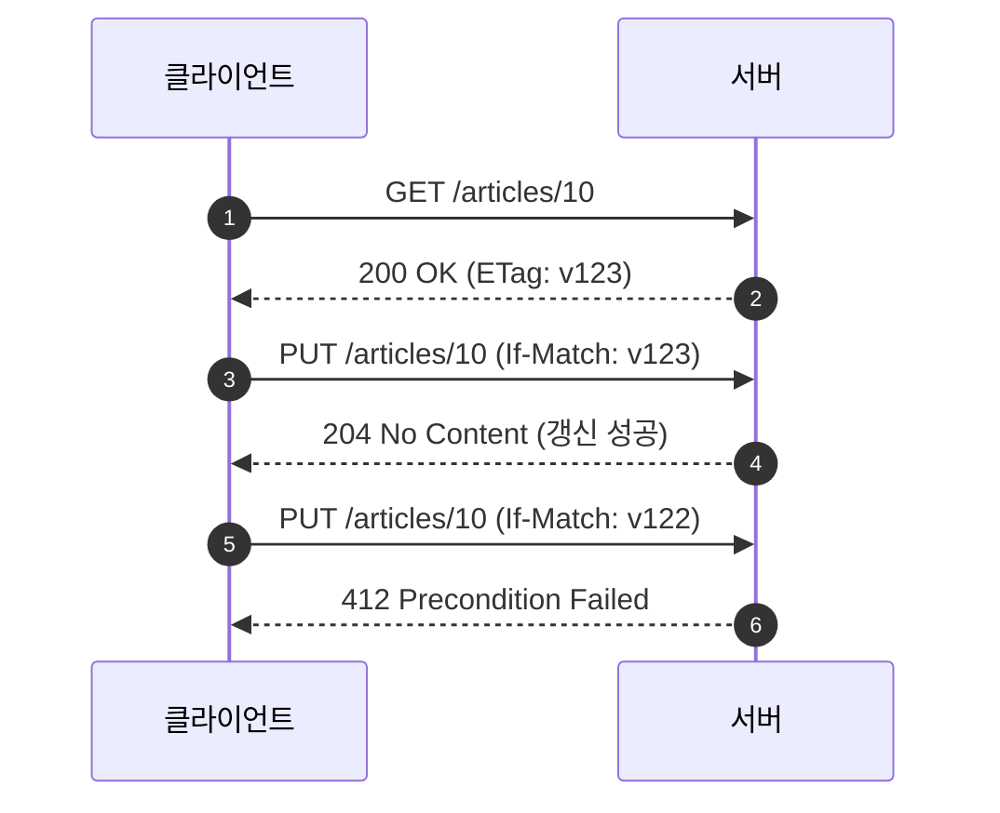
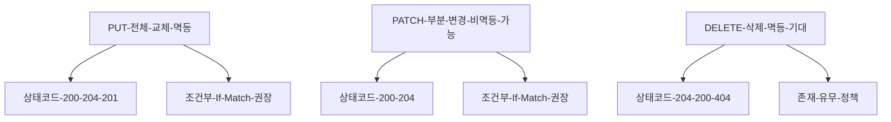
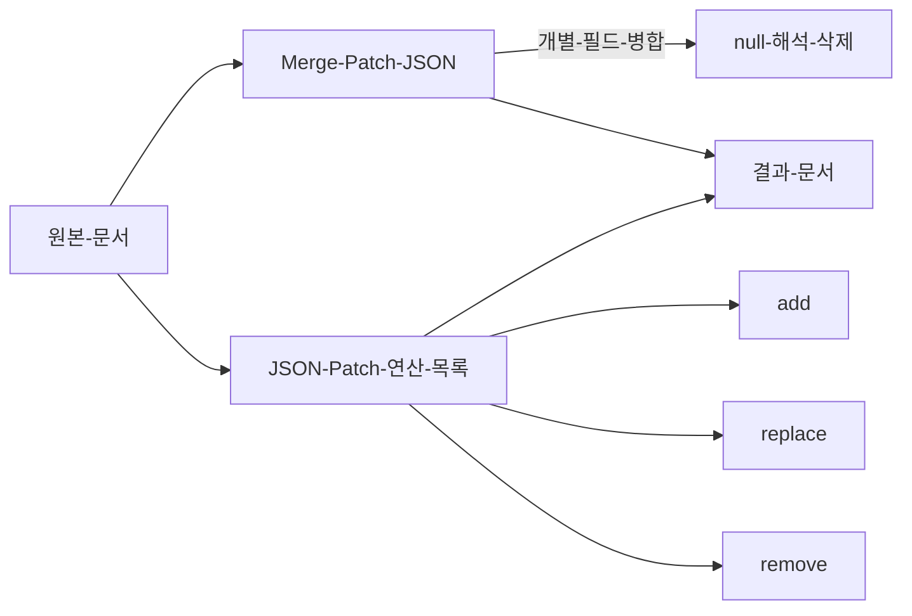

# Chapter 04 HTTP 메서드

## 04-3 HTTP 메서드 - PUT, PATCH, DELETE

### 개요
이 섹션에서는 리소스 변경에 사용되는 PUT, PATCH, DELETE의 의미와 차이를 학습합니다. PUT은 보통 리소스의 “전체 교체”로서 멱등적으로 동작해야 하며, PATCH는 “부분 변경”을 의미하고 멱등이 아닐 수 있습니다. DELETE는 리소스를 삭제하며 멱등적 동작이 기대됩니다. 또한 조건부 갱신(ETag/If-Match), JSON Patch vs Merge Patch, 상태코드 선택(200/201/204/404/409/412)과 재시도/경쟁 상황에 대한 실무 팁을 다룹니다.

학습 목표
- PUT, PATCH, DELETE의 의미와 멱등성 기대치를 설명할 수 있다.
- 전체 교체와 부분 변경의 차이, JSON Patch와 Merge Patch의 개념을 구분할 수 있다.
- 조건부 갱신(If-Match/ETag)을 사용하여 동시성 충돌을 방지하는 방법을 설명할 수 있다.
- 적절한 상태코드(200/201/204/404/409/412)와 헤더(Location, ETag) 선택을 제시할 수 있다.

### PUT: 전체 교체(보통 멱등)
- 의미: 대상 리소스를 “주어진 표현으로 교체”한다. 존재하지 않으면 생성 허용 여부는 정책에 따라 다름(서버/조직 규약 필요).
- 멱등(Idempotent): 같은 요청을 반복해도 결과 상태가 동일해야 한다.
- 전송: 보통 전체 리소스 표현을 바디에 담아 전송(JSON 등).
- 상태코드:
  - 기존 존재 → 200 OK 또는 204 No Content
  - 존재하지 않음 + 생성 허용 → 201 Created (+ Location)
  - 조건부 실패 → 412 Precondition Failed

### PATCH: 부분 변경(보통 비멱등)
- 의미: 리소스의 일부 속성만 변경. 문서 패치로 표현.
- 멱등성: 패치 문서의 의미에 따라 달라질 수 있으나 일반적으로 보장하지 않는다.
- 대표 포맷 두 가지 요약:
  - Merge Patch(RFC 7396): application-merge-patch+json, 주어진 필드만 병합/삭제(null로 제거 해석 가능)
  - JSON Patch(RFC 6902): application-json-patch+json, 연산 목록(add, replace, remove 등)으로 명시
- 상태코드: 200 OK(변경된 표현 반환) 또는 204 No Content

### DELETE: 삭제(멱등 기대)
- 의미: 대상 리소스 제거.
- 멱등성: 이미 삭제된 상태에서 다시 DELETE해도 결과 상태는 동일(404 또는 204 등 정책에 따름).
- 상태코드: 204 No Content(일반적), 200 OK(본문 포함 시), 존재하지 않음은 404 Not Found 가능(정책).

### 조건부 갱신과 병행 제어(ETag / If-Match)
- 목적: 마지막 읽기 이후 다른 클라이언트가 수정한 경우를 탐지하여 충돌 방지.
- 흐름: 클라이언트가 GET으로 ETag를 수신 → 변경 시 If-Match: <etag>로 제출 → 불일치 시 412.

### PUT vs PATCH vs DELETE 한눈 비교

### JSON Patch vs Merge Patch 개념 흐름

### 실무 팁
- PUT 업서트 정책: 존재하지 않을 때 생성 허용 여부를 명확히 문서화. 허용 시 201 + Location 고려.
- PATCH 포맷 선택: 단순 부분 변경은 Merge Patch, 정밀 제어/감사를 원하면 JSON Patch.
- 멱등 재시도: 네트워크 오류 재시도 시 PUT/DELETE는 비교적 안전, PATCH/POST는 주의. 서버 측 중복 방지 키 전략도 유용.
- 상태코드 일관성: 204는 바디 없이 반환. 표현 변경을 돌려줄 때는 200.
- 보안: 변경/삭제는 인증/인가 필수. 항상 HTTPS. 감사 로그/감사 필드 업데이트.

### 7가지 키워드로 정리하는 핵심 포인트
1. **PUT-전체-교체**: 같은 요청 반복에도 상태 동일한 멱등 동작이 기대된다.
2. **PATCH-부분-변경**: 부분 갱신에 적합하며 일반적으로 비멱등 가능성이 있다.
3. **DELETE-멱등-기대**: 이미 삭제된 경우 반복 호출해도 최종 상태는 같다.
4. **조건부-갱신**: ETag/If-Match로 동시성 충돌을 방지한다.
5. **패치-표준**: Merge Patch는 병합, JSON Patch는 연산 목록으로 표현.
6. **상태코드-선택**: 200/201/204/404/409/412를 맥락에 맞게 사용.
7. **정책-문서화**: PUT 업서트/DELETE 응답 정책/멱등 재시도 원칙을 문서화한다.

### 확인 문제
1. 다음 중 PUT에 대한 설명으로 가장 옳은 것은?
    - [ ] 부분 변경에 적합하며 비멱등인 것이 일반적이다
    - [ ] 리소스 전체를 주어진 표현으로 교체하며 멱등적 동작이 기대된다
    - [ ] 서버 상태를 변경하지 않는 안전한 메서드다
    - [ ] 업서트가 표준으로 강제되어 항상 201을 반환해야 한다

2. 다음 중 PATCH에 대한 설명으로 옳은 것은?
    - [ ] JSON Patch는 null을 삭제로 해석하는 병합 규칙을 사용한다
    - [ ] Merge Patch는 연산 목록(add/replace/remove)을 사용해 경로별 변경을 지정한다
    - [ ] PATCH는 부분 변경에 적합하며 멱등이 아닐 수 있다
    - [ ] PATCH는 항상 멱등이며 재시도해도 절대 문제가 없다

3. 다음 중 옳은 것을 모두 고르시오. (복수 응답)
    - [ ] DELETE는 멱등적 동작이 기대된다
    - [ ] If-Match와 ETag를 사용하면 경쟁 상황에서 갱신 충돌을 방지할 수 있다
    - [ ] PUT은 존재하지 않으면 언제나 404를 반환해야만 한다
    - [ ] PATCH는 application-json-patch+json 같은 미디어 타입을 사용할 수 있다
    - [ ] 204 No Content는 바디를 포함해도 된다

> [정답 및 해설 보기](../answers_and_explanations.md#ans-04-3-http-메서드-put-patch-delete)
