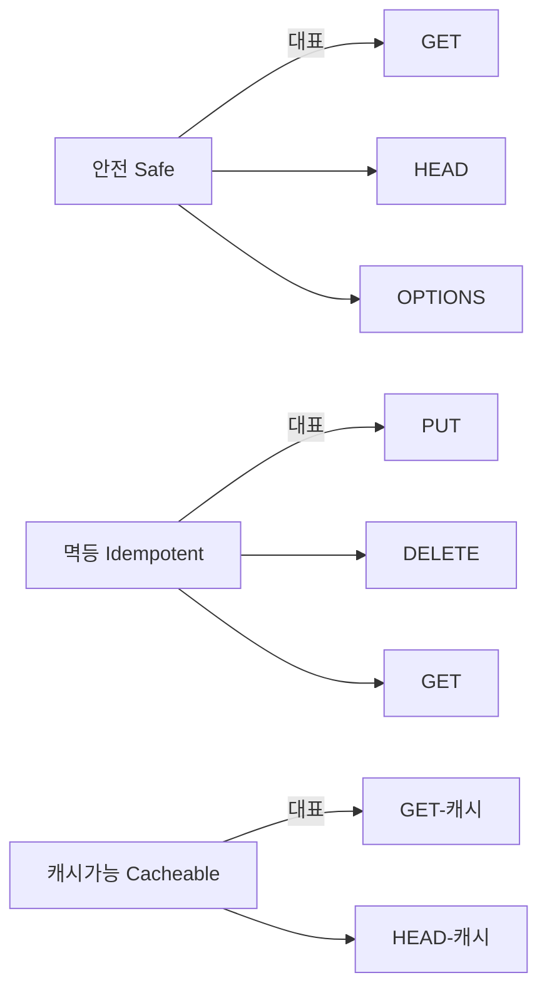
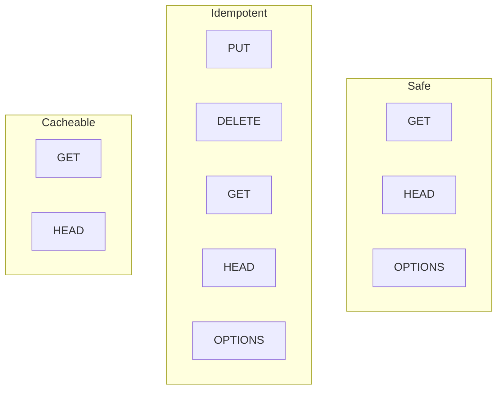
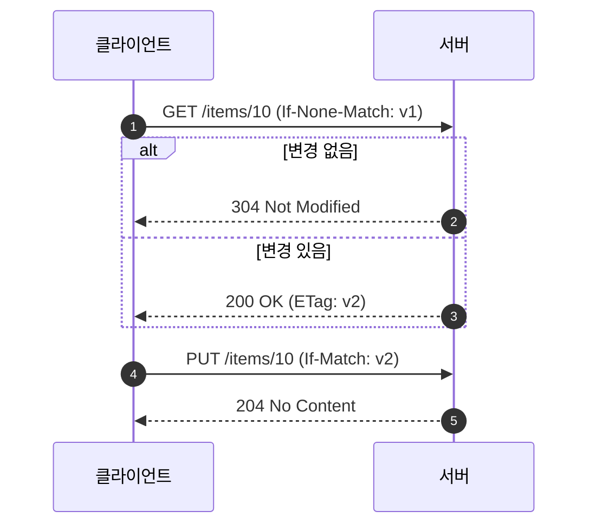
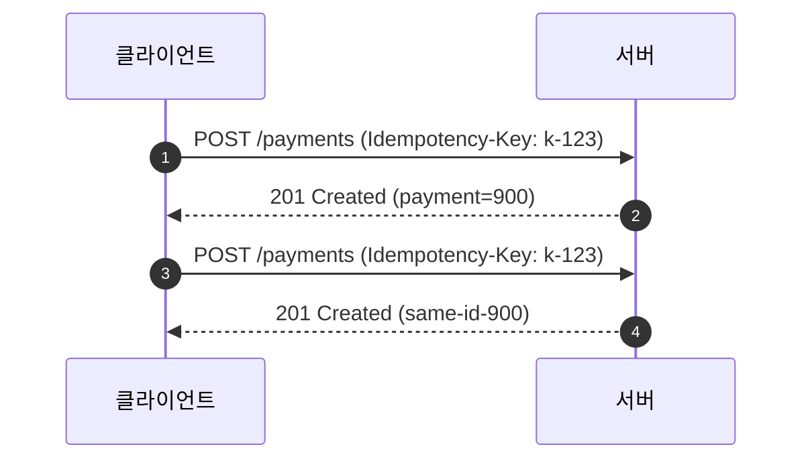

# Chapter 04 HTTP 메서드

## 04-4 HTTP 메서드의 속성

### 개요
이 섹션에서는 HTTP 메서드의 공통 속성인 안전성(Safe), 멱등성(Idempotent), 캐시가능성(Cacheable)을 체계적으로 정리합니다. 각 속성이 의미하는 바와 실무에서의 해석 차이, 대표 메서드들과의 관계를 살펴보고, 조건부 요청(ETag/If-Match, If-None-Match)과 병행 제어가 멱등성과 재시도 전략에 어떻게 기여하는지도 설명합니다. 또한 네트워크 오류나 타임아웃 상황에서의 재시도 정책, 부작용(side effect) 관리, Idempotency-Key 패턴을 다룹니다.

학습 목표
- Safe/Idempotent/Cacheable의 의미를 명확히 구분할 수 있다.
- GET/HEAD/PUT/DELETE/POST/PATCH/OPTIONS 등 메서드의 속성 적용을 설명할 수 있다.
- 조건부 요청과 ETag 기반 병행 제어가 재시도/충돌 방지에 주는 효과를 말할 수 있다.
- 부작용과 재시도 정책 설계, Idempotency-Key 패턴을 설명할 수 있다.

### 세 가지 핵심 속성의 정의
- 안전성(Safe): 요청이 서버의 가시적 상태를 변경하지 않는 특성. 대표: GET, HEAD, OPTIONS, TRACE
- 멱등성(Idempotent): 동일한 요청을 여러 번 보내도 최종 상태가 동일한 특성. 대표: PUT, DELETE, GET, HEAD, OPTIONS, TRACE
- 캐시가능성(Cacheable): 표준적으로 캐시가 허용되는 응답을 만들어낼 수 있는 특성. 대표: GET(일반적), HEAD(일반적). POST/DELETE/PATCH도 이론상 가능하지만 실무에선 드묾.

주의
- 안전과 멱등은 "의도된 의미"에 대한 속성이다. 잘못된 서버 구현이나 부작용(로그/카운터 증가 등)이 존재해도 표준 의미는 바뀌지 않는다.
- 멱등은 "응답 본문이 항상 동일"을 의미하지 않는다. 최종 리소스 상태가 같으면 멱등일 수 있다(예: 같은 PUT을 두 번 보내도 결과 상태는 동일, ETag는 바뀔 수 있음).

### 메서드별 속성 요약
- GET: Safe, Idempotent, Cacheable(보통)
- HEAD: Safe, Idempotent, Cacheable(보통)
- OPTIONS: Safe, Idempotent, Cacheable 아님(통상)
- TRACE: Safe, Idempotent
- PUT: Idempotent(보통), Safe 아님, Cacheable 아님
- DELETE: Idempotent(기대), Safe 아님, Cacheable 아님
- POST: Safe 아님, Idempotent 아님(일반적), Cacheable 드묾
- PATCH: Safe 아님, Idempotent 아님(일반적), Cacheable 아님

### 조건부 요청과 병행 제어
- 읽기 검증: If-None-Match + ETag → 변경 없으면 304 Not Modified로 대역폭 절감
- 갱신 병행 제어: If-Match + ETag → 불일치 시 412 Precondition Failed로 충돌 방지
- 멱등/재시도 관계: 조건을 포함한 PUT/DELETE는 네트워크 오류 재시도 시에도 최종 상태를 안전하게 유지하기 쉬움

### 재시도 전략과 부작용 관리
- 네트워크 오류/타임아웃 시 재시도 정책:
  - 멱등 메서드(GET/PUT/DELETE/HEAD/OPTIONS)는 재시도에 상대적으로 안전
  - 비멱등 메서드(POST/PATCH)는 자동 재시도 주의 필요 → 클라이언트/중간자 자동 재시도 비활성 또는 방지 장치
- Idempotency-Key 패턴(주로 POST): 동일 키로 들어온 요청은 단일 결과로 결론 나도록 서버가 중복을 억제
  - 요청 헤더 예: Idempotency-Key: 7f1e-...
  - 서버는 키 기준으로 요청 처리 결과를 저장/재사용하여 중복 생성 방지

### 캐시와 메서드
- GET/HEAD는 기본적으로 캐시 친화적. Cache-Control, ETag/Last-Modified로 신선도/검증 제어
- POST/PUT/DELETE/PATCH는 일반적으로 캐시 대상이 아님. 예외적 표준 동작이 있지만 실무 호환성 낮음
- 캐시 무효화 측면: 서버는 리소스 변경 시 적절한 Cache-Control, ETag 갱신, Surrogate-Key/CDN 무효화 정책을 운용

### 7가지 키워드로 정리하는 핵심 포인트
1. **Safe**: 서버 상태를 바꾸지 않는 의미. GET/HEAD/OPTIONS가 대표.
2. **Idempotent**: 같은 요청을 여러 번 보내도 최종 상태 동일. PUT/DELETE/GET/HEAD/OPTIONS.
3. **Cacheable**: GET/HEAD는 기본 캐시 대상. 나머지는 제한적.
4. **조건부 요청**: If-None-Match/If-Match와 ETag로 검증/병행 제어.
5. **재시도 정책**: 멱등 메서드는 재시도에 유리, POST/PATCH는 Idempotency-Key 등 보완.
6. **부작용 관리**: 로깅/카운터 같은 부수효과는 의미 속성과 별개로 설계/억제 필요.
7. **실무 적용**: 캐시 헤더, ETag, 재시도/중복 방지 키를 일관 정책으로 문서화.

### 확인 문제
1. Safe/Idempotent/Cacheable에 대한 설명으로 옳은 것은?
    - [ ] 멱등은 응답 본문이 항상 동일함을 의미한다
    - [ ] Safe는 서버 상태를 변경하지 않는 의미적 속성이다
    - [ ] Cacheable은 모든 메서드에 동일하게 적용된다
    - [ ] Safe인 메서드는 항상 캐시 가능하다

2. 조건부 요청과 멱등성/재시도에 관한 설명으로 가장 적절한 것은?
    - [ ] If-Match는 변경 없음을 확인해 304를 받기 위한 헤더다
    - [ ] If-None-Match는 갱신 충돌을 방지하기 위해 사용된다
    - [ ] PUT에 If-Match를 사용하면 네트워크 오류 재시도 시에도 중복 갱신을 줄이는 데 도움이 된다
    - [ ] ETag는 캐시와 무관하며 병행 제어에서만 사용된다

3. 다음 중 옳은 것을 모두 고르시오. (복수 응답)
    - [ ] GET은 Safe이며 멱등이고 캐시 가능하다
    - [ ] PUT은 일반적으로 멱등이며 Safe이다
    - [ ] DELETE는 멱등적 동작이 기대된다
    - [ ] POST는 일반적으로 비멱등이며 Idempotency-Key로 중복 생성을 줄일 수 있다
    - [ ] PATCH는 항상 멱등이므로 자동 재시도에 적합하다

> [정답 및 해설 보기](../answers_and_explanations.md#ans-04-4-http-메서드의-속성)
