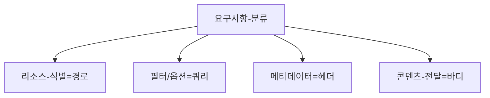
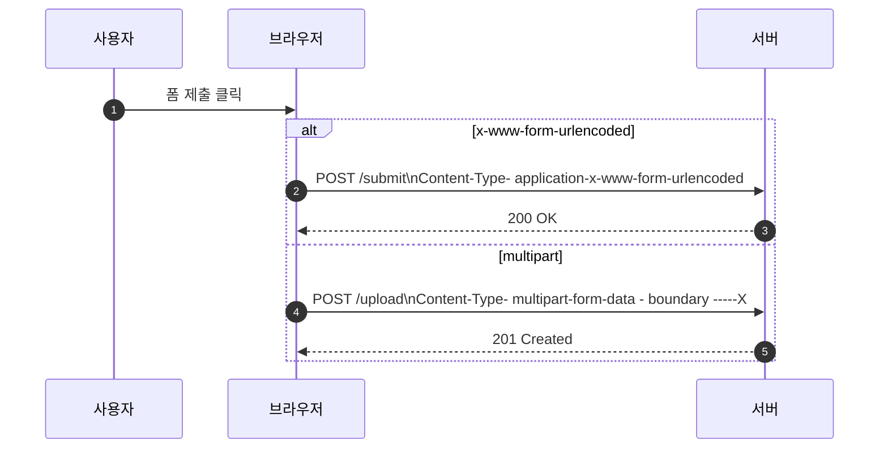
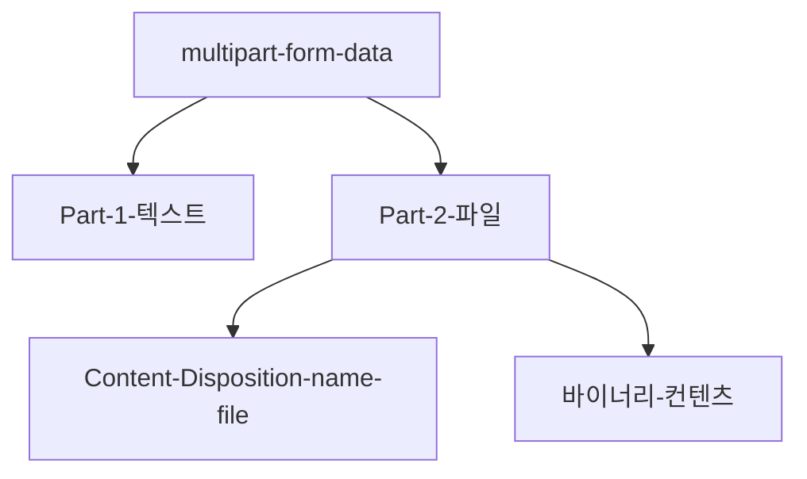

# Chapter 05 HTTP 메서드 활용

## 05-1 클라이언트에서 서버로 데이터 전송

### 개요
이 섹션에서는 클라이언트가 서버로 데이터를 전송하는 다양한 방법을 정리합니다. 경로/쿼리/헤더/바디의 책임 분리 원칙, GET 쿼리 파라미터와 POST 바디의 적절한 사용, 폼 전송 방식(application-x-www-form-urlencoded, multipart-form-data)의 차이, JSON 전송 시의 Content-Type/Accept 설정, 파일 업로드와 대용량 업로드 전략, 보안/실무 주의사항을 다룹니다.

학습 목표
- 경로, 쿼리, 바디의 역할 차이와 올바른 사용 시점을 설명할 수 있다.
- 폼 전송 두 방식(x-www-form-urlencoded, multipart-form-data)의 차이를 사례로 설명할 수 있다.
- JSON 전송 시 Content-Type/Accept/charset을 올바르게 설정할 수 있다.
- 민감 정보 전송, 크기 제한, 인코딩, 캐시/로그 노출 등 실무 주의사항을 제시할 수 있다.

### 데이터는 어디에 담을까? 경로/쿼리/헤더/바디
- 경로(Path): 리소스 식별. 예: `/users/42`, `/orders/100/items` 
- 쿼리(Query): 필터/정렬/페이지네이션/옵션. 예: `/search?q=book&sort=price`
- 헤더(Headers): 메타데이터/협상/인증. 예: `Accept`, `Authorization`, `If-None-Match`
- 바디(Body): 표현(payload). 주로 생성/갱신/명령에 필요한 데이터(JSON/폼/멀티파트 등)



가이드라인 요약
- 리소스 식별은 경로, 조회 옵션은 쿼리, 표현 데이터는 바디.
- 민감 정보는 URL(경로/쿼리)에 두지 말고 바디/헤더 사용.
- GET은 주로 쿼리로 전달, 생성/갱신은 보통 POST/PUT/PATCH 바디 사용.

### 폼 전송: application-x-www-form-urlencoded vs multipart-form-data
- application-x-www-form-urlencoded
  - 키-값 쌍을 `&`로 연결. 공백은 `+` 또는 `%20`, 특수문자는 퍼센트 인코딩.
  - 텍스트 위주, 소용량 데이터에 적합.
  - 예시 바디: `name=lee&age=20`
- multipart-form-data
  - 경계(boundary)로 파트를 구분, 각 파트마다 헤더와 내용 포함.
  - 파일 업로드/복합 데이터(텍스트+파일)에 적합.
  - Content-Type: `multipart/form-data; boundary=----X`



멀티파트 구조 개요


### JSON 전송
- 요청: `Content-Type: application/json; charset=utf-8` 권장, 응답 선호: `Accept: application/json`.
- 예시 요청
```
POST /orders HTTP/1.1
Content-Type: application/json; charset=utf-8
Accept: application/json

{"productId": 100, "quantity": 2}
```
- 예시 응답
```
HTTP/1.1 201 Created
Location: /orders/101
Content-Type: application/json; charset=utf-8

{"id":101, "status":"created"}
```

### 파일/대용량 업로드 간단 가이드
- 일반 업로드: multipart-form-data 사용.
- 대용량/불안정 네트워크: 청크 업로드/재개 업로드 프로토콜 설계(애플리케이션 레벨), 무결성 검증 해시 활용.
- 서버 제한 고려: 최대 바디 크기, 타임아웃, 임시 저장소, 바이러스 스캔.

### 보안과 실무 주의
- 민감 정보(URL 금지): 쿼리/경로는 로그/북마크/레퍼러로 노출되기 쉬움 → 바디/헤더 사용, 항상 HTTPS.
- CSRF/CORS 관점: 브라우저 폼 전송은 CSRF에 노출될 수 있음 → SameSite 쿠키, CSRF 토큰, Origin/Referer 검증.
- 인코딩: 서버 파서가 charset을 올바르게 처리하도록 설정(JSON은 UTF-8 권장).
- 크기/유효성 검증: 서버에서 최대 크기 제한과 필드 검증 수행, 에러 시 400/413 등 활용.
- 캐시: GET 쿼리는 캐시 대상, POST 바디는 일반적으로 캐시되지 않음.

### 7가지 키워드로 정리하는 핵심 포인트
1. **책임-분리**: 경로=식별, 쿼리=옵션, 헤더=메타, 바디=콘텐츠.
2. **폼-두-가지**: x-www-form-urlencoded는 단순 키-값, multipart는 파일/복합 데이터.
3. **JSON-표준-헤더**: Content-Type과 Accept를 명확히.
4. **민감정보-보호**: URL에 두지 말고 바디/헤더로, HTTPS 필수.
5. **업로드-전략**: 멀티파트 기본, 대용량은 청크/재개 설계.
6. **캐시-차이**: GET 쿼리는 캐시 우선, POST 바디는 보통 비캐시.
7. **유효성/제한**: 크기 제한, 인코딩, 검증으로 안정성 확보.

### 확인 문제
1. 다음 중 쿼리 파라미터와 메시지 바디 사용에 대한 설명으로 가장 적절한 것은?
    - [ ] 리소스 식별도 쿼리에 두는 것이 일반적이다
    - [ ] 필터/정렬/페이지네이션은 보통 바디로 전송한다
    - [ ] 리소스 식별은 경로, 필터/옵션은 쿼리, 표현 데이터는 바디가 적절하다
    - [ ] 민감 정보는 URL에 두면 북마크하기 쉬워 안전하다

2. 다음 중 폼 전송 방식과 설명의 연결이 올바른 것은?
    - [ ] application-x-www-form-urlencoded: 파일 업로드에 최적화되어 있다
    - [ ] multipart-form-data: 경계로 파트를 나누어 텍스트와 파일을 함께 전송할 수 있다
    - [ ] application-x-www-form-urlencoded: 파일 바이너리를 그대로 포함한다
    - [ ] multipart-form-data: 키-값을 `&`로만 연결해 전송한다

3. 다음 중 옳은 것을 모두 고르시오. (복수 응답)
    - [ ] JSON 전송 시 Content-Type: application/json을 사용한다
    - [ ] 민감 정보는 URL보다 바디/헤더로 전송하는 것이 안전하다
    - [ ] 대용량 파일은 보통 application-x-www-form-urlencoded가 가장 적합하다
    - [ ] GET 쿼리 파라미터는 로그/레퍼러에 남을 수 있다
    - [ ] multipart-form-data는 파일 업로드에 적합하다

> [정답 및 해설 보기](../answers_and_explanations.md#ans-05-1-클라이언트에서-서버로-데이터-전송)
